!!! quote "Cite"

	[简明LaTeX教程_哔哩哔哩_bilibili](https://www.bilibili.com/video/BV1ihYKeQEKH?vd_source=bf57a3936cdb31aed71aab25cbdfbd70&spm_id_from=333.788.videopod.episodes)
	
	[Perplexity|discover](https://www.perplexity.ai/discover)

## 1. LaTex 在线环境

LaTex 是一种排版系统，将标记语言编译为 PDF。

学习或者只写一些简单文档可以使用在线环境。

- 优点：简单、开箱即用，不用关心环境问题，不受设备限制，可以在线协同，…
- 缺点：网络限制，需要注册，资源受限，数据安全，…
- 网址：[Overleaf](https://cn.overleaf.com/)，[TeXPage](https://www.texpage.com/)

## 2. Windows 本地环境

LaTeX 发行版：

- TeXLive：宏包多，不依赖网络环境，占用空间大，…
- MiKTeX：基础宏包少，需要网络下载宏包，占用空间小，…

安装及配置：

- TeXlive： [【超详细】最好用LaTex环境安装配置手把手教_哔哩哔哩_bilibili](https://www.bilibili.com/video/BV1sw411t7Zw/?vd_source=bf57a3936cdb31aed71aab25cbdfbd70)
- TeXstudio：[Latex本地编译器安装：TexLive + TextStudio_哔哩哔哩_bilibili](https://www.bilibili.com/video/BV1zg4y1n75x/?vd_source=bf57a3936cdb31aed71aab25cbdfbd70)
- VScode：[vscode编译Latex配置](https://kezhi.tech/26b82930.html)

## 3. 学习资料

### 3.1 基础书籍

- LaTeX 2e 完全学习手册
- LaTeX Cookbook Over 90 hand_
- LaTeX in 24 Hours A Practic_
- LaTeX 入门
- Inotes2
- Ishort-zh-cn
- Itxprimer-1.0
- pgfmanuai
- TikZ_PGFManua 笔记
- 简单粗暴 LaTex

### 3.2 常用网址

- [LaTex-Project](https://www.latex-project.org)
- [LaTex 工作室](https://www.latexstudio.net/)
- [文档网址](https://texdoc.org/)
- [英文社区](https://tex.stackexchange.com/)
- [英文教程](https://www.learnlatex.org/en/)
- [清华大学开源镜像站 (LaTex 相关位于 CTAN 路径下)](https://mirrors.tuna.tsinghua.edu.cn/)
- 本地文档查看: 命令行 (终端)  texdoc  <包名>

## 4. 源代码结构

```tex
% 导言区
\documentclass{article} % 文档类
\usepackage{ctex} % 中文宏包 或者 \documentclass{ctexart}

\begin{document} % 命令 环境
% 正文区
\%               % 输出'%'
\#               % 输出'#'
\textbackslash   % 输出'\'
\{\}             % 输出'{}'
\end{document}
```

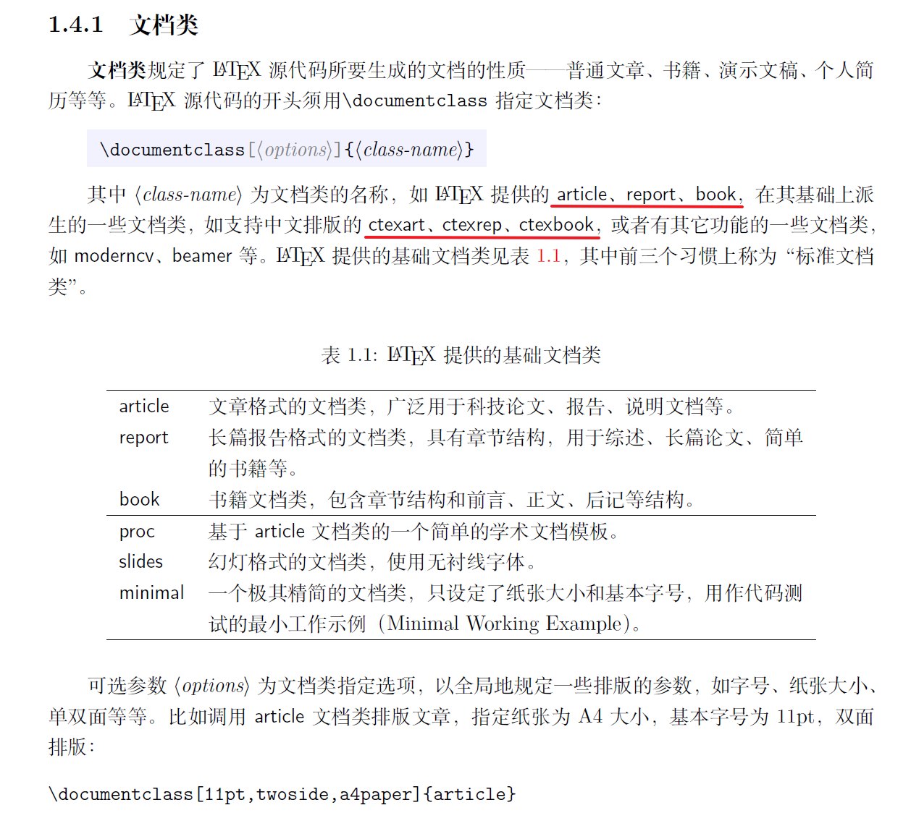{ width="500" }

## 5. 标题、作者、日期

```tex
\documentclass{article} 
% \documentclass{book} 不同类中标题、作者、日期的格式不同
\usepackage{ctex}

% 标题 作者 日期
\title{\LaTeX 从入门到放弃}
\author{王今天 \and 王明天\thanks{Email:123456@qq.com} \and 王后天}
\date{\today}

\begin{document}
\maketitle
\end{document}
```

## 6. 换行、分段、空格

```tex
\documentclass{article} 
\usepackage{ctex} 

\begin{document} 
% \\ 或 \newline 表示换行
% 空一行（多行） 或者 \par 表示分段，首行缩进
% 水平空格：\hspace{1em}，单位可以换成pt/cm/in等等
% 垂直空格：\vspace{0.3em}
% 后面没有{}的命令后面不能直接跟内容，可以隔一个空格

第一回\hspace{1em}灵根育孕源流出\hspace{0.5em}心性修持大道生 \\
\vspace{0.3ex}
诗日： \newline 混沌未分天地乱，
茫茫渺渺无人见。\\
自从盘古破鸿蒙，开辟从兹清浊辨。\newline
覆载群生仰至仁，发明万物皆成善。 \\
欲知造化会元功，须看《西游释厄传》。\\

\end{document}
```

## 7. 居中、取消缩进、行距

```tex
\documentclass{ctexart} % 文档类
% \usepackage{ctex} % 宏包

\usepackage{setspace} % 引入设置行距的宏包
% \singlespacing \onehalfspacing \doublespacing：这里的单倍、1.5倍、2倍指的是字号的倍数，并非基础行距的倍数
% \setstretch{}：设置任意行距（基础行距的倍数，同linspread）

% 取消缩进：在段落上面一行写 \noindent，
% 取消缩进（全局）：在导言区写 \parindent = 0pt 或 \setlength{\parindent}{0pt}

% 1倍行距 = 1 ＊ 基础行距
% 1.5倍行距 = 1.5 * 基础行距
% 基础行距 = 1.2 ＊ 字号
% word基础行距 = 1.3 ＊ 字号
% 效果相同：latex = word * 1.3 / 1.2
% 设置行距：在段落上面一行写 \linespread{2}\selectfont
% 设置行距（全局）：在导言区写 \linespread{2} % 默认 1.3  

\begin{document} 

% \begin{ceter}
% \end{center}
% flushleft：居左，flushright：居右

\begin{center}
第一回\hspace{1em}灵根育孕源流出\hspace{0.5em}心性修持大道生
\end{center}

诗曰：
\begin{center}
混沌未分天地乱，茫茫渺渺无人见。\\
自从盘古破鸿蒙，开辟从兹清浊辨。\\ % 若用 \newline 会往前边挤
覆载群生仰至仁，发明万物皆成善。 \\
欲知造化会元功，须看《西游释厄传》。% 最后的换行可以不要
\end{center}

\noindent
一个神秘爬行动物的到来，把温馨的动物城搅动得天翻地覆。面对全新的城市危机，警官兔朱迪（金妮弗·古德温 Ginnifer Goodwin 配音）与狐尼克（杰森·贝特曼 Jason Bateman 配音）将继续携手为保卫动物城而奔波。在追捕行动中，这对老搭档不仅要揭开新角色的神秘面纱，还要前往被迷雾笼罩的新领域，探索未知的地下黑市，一场疯狂动物城的全新冒险即将展开……

% 注意要加{}和分段后行距设置才会生效
{\linespread{2}\selectfont
兔朱迪与狐尼克这对银幕经典搭档，终于带着《疯狂动物城2》回来了！影片于昨日在中国内地与北美同步上映，预售票房已突破3.2亿元，创下进口喜剧片历史最高纪录；猫眼平台更是大胆预测其总票房有望冲击26亿元。海外口碑同样亮眼，烂番茄新鲜度高达93\%，开局堪称华丽。\par}

% 通过setspace宏包设置行距
\begin{spacing}{2} % 基础行距的2倍
影片巧妙延续了前作对职场刻板印象的讽刺，同时引入更宏大的社会议题：围绕寻找气候墙专利证书展开的哺乳动物与爬行动物族群对立，不仅搭建起了故事的骨架，更隐喻了美国社会现实中的“物种隔离”“历史遗忘”与“身份认同”等深层矛盾。能吸引孩子，也让成年观众会心一笑——真正做到了“合家欢”。
\end{spacing}

\end{document}
```

## 8. 字号与字体

### 8.1 字号

```tex
\documentclass[11pt]{ctexart} % 正文字号，默认为11pt，这里只能修改为10 11 12 
% \usepackage{ctex} % 宏包
\begin{document} 

% 根据表格内容调用命令
% \Huge 命令之后的字体大小改变，可以加{}设置部分字体的字体大小
{\Huge
费翔在配音过程中}，其标志性的“非标准普通话”成为了观众吐槽的焦点。由于长期在国外生活，费翔的普通话带有老派港台腔，卷舌音和儿化音使用不标准，导致台词里的字像“含着糖”一样黏在一起。

% \begin{Huge}和\end{Huge}包裹内容，也可以设置部分字体的字体大小
\begin{Huge}
例如，他将“马飞扬市长”念成“马飞羊”“马肥羊”，关键字词的发音模糊，直接影响了观众的观影体验。不少观众表示，在影院观看时，费翔的台词部分听得十分吃力，甚至需要借助字幕才能理解。
\end{Huge}

% \fontsize{字体大小}{基础行距}\selectfont 设置任意字号字体，可以加{}
{\fontsize{18pt}{18pt}\selectfont
面对观众的吐槽}，有业内人士指出，动画配音的核心在于用声音为角色“长出血肉”，让声音“服务于角色”而非“凸显自我”。相比之下，专业配音演员的核心竞争力正在于他们能让声音“服务于角色”而非“凸显自我”。

% \zihao{字号} ctexart文档类或ctex宏包提供，可以加{}
{\zihao{5}
首先，《头号玩家》}展现了一个富有想象力的虚拟世界——“绿洲”，这个由詹姆斯·哈利迪创造的虚拟现实游戏世界充满了令人叹为观止的奇幻景观和刺激的游戏挑战。观众将被带入一个全新的视听盛宴，享受到沉浸式的虚拟体验，感受到科技与创意的巧妙结合。

\end{document}
```

{ width="400" }

{ width="400" }

### 8.2 字体

```tex
\documentclass{article} 
\usepackage{ctex}
\usepackage{fontspec} % 英文字体宏包
\usepackage{xeCJK} % 中日韩语言宏包

\parindent = 0pt

% 使用 fontspec 宏包设置字体（全局）
% 设置衬线、非衬线、等宽字体，使用 \rmfamily \sffamily \ttfamily 时会分别调用设置的字体
% \setmainfont{⟨font name⟩} % 主字体
% \setsansfont{⟨font name⟩}
% \setmonofont{⟨font name⟩}

% 自定义切换字体命令
\newfontfamily{\cls}{Consolas}

% 使用 xeCJK 宏包设置中文字体，用法同 fontspec 宏包，汉字名称不生效则写英文名称
% \setCJKmainfont{华文行楷} % 设置全局
% {\CJKfontspec{华文行楷} 内容} % 设置局部
% \newCJKfontfamily{\xk}{华文行楷}

\begin{document}

% 预设字体：\songti（默认） \heiti \yahei \fangsong \kaishu \lishu（在线无） \youyuan
% \heiti % 设置之后字体为黑体
\begin{center}
	\heiti % 设置这里的字体为黑体
	第一回\hspace{1em}灵根育孕源流出\hspace{0.5em}心性修持大道生
\end{center}

% 设置部分字体为黑体
{\heiti
其次，《头号玩家》}通过讲述一个紧张刺激的冒险故事，吸引观众的注意力并保持着紧凑的节奏。故事发生在2045年，主人公韦德·沃兹追寻着詹姆斯·哈利迪留下的遗产和谜题，进入了绿洲的竞争中。

% 这样也能设置部分字体为黑体
\begin{heiti}
观众随着他的冒险旅程，揭开了一个关于友情、勇气和坚持的故事。这种紧张刺激的情节设计使观众沉浸其中，一同感受到了角色的成长和奋斗。
\end{heiti}

% 加粗
{\bfseries
One shade the more, one ray the less, \\
Had half impaired the nameless grace \\
Which waves in every raven tress, \\
Or softly lightens o'er her face; \\
Where thoughts serenely sweet express, \\
How pure, how dear their dwelling-place \\ }

% 斜体
{\itshape
Since the match was played at Wembley Stadium, it attracted 74,611 spectators to watch the game. The England women's football team, which has just won the European Championship, has made its main play, with five of the six players in the midfield starting in the European Championship final.}

% rmfamily 衬线字体（默认）
% sffamily 非衬线字体
% ttfamily 等宽字体
{\sffamily
Among them, Stanway, who plays for Bayern Women, scored a hat-trick, Arsenal Women's Mead also scored twice, and Manchester United midfielder Thun scored 1 shot and 3 passes.}

% 使用 fontspec 宏包设置字体（局部）
{\fontspec{Consolas}
The director did not give a clear answer to whether the relationship between Judy and Nick was set as a colleague or a lover, but everyone still knocked on CP on their own.}

% 使用自定义命令更改字体，需在导言区进行设置
{\cls
Almost every girl has fantasized that she will meet the perfect man who is handsome, understands herself, can solve problems and is willing to spend money on herself.}

{\CJKfontspec{华文行楷} 
春江潮水连海平，海上明月共潮生。\\  
滟滟随波千万里，何处春江无月明。\\  
江流宛转绕芳甸，月照花林皆似霰。\\  
空里流霜不觉飞，汀上白沙看不见。\\  
江天一色无纤尘，皎皎空中孤月轮。\\  
江畔何人初见月？江月何年初照人？\\  
人生代代无穷已，江月年年望相似。\\
不知江月待何人，但见长江送流水。\\  
白云一片去悠悠，青枫浦上不胜愁。\\  
谁家今夜扁舟子？何处相思明月楼？\\  
可怜楼上月裴回，应照离人妆镜台。\\
玉户帘中卷不去，捣衣砧上拂还来。\\  
此时相望不相闻，愿逐月华流照君。\\  
鸿雁长飞光不度，鱼龙潜跃水成文。\\  
昨夜闲潭梦落花，可怜春半不还家。\\  
江水流春去欲尽，江潭落月复西斜。\\  
斜月沉沉藏海雾，碣石潇湘无限路。\\  
不知乘月几人归，落月摇情满江树。}

\end{document}
```

{ width="400" }

查看有哪些字体：

（1） 通过 Texstudio 查看

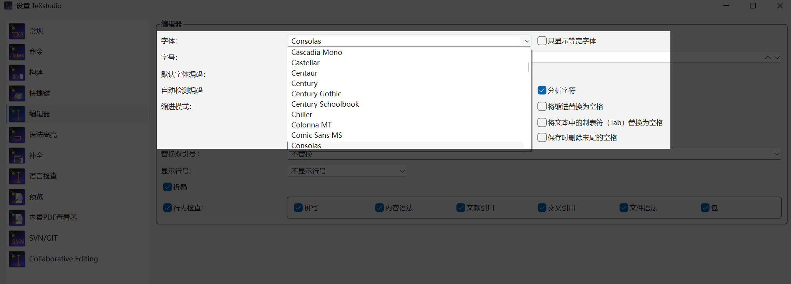
（2） 通过命令行查看（本地装 MiKTeX + XeLaTeX）

```bash
fc-list -f "%{family}\n"               # 查看所有字体
fc-list -f "%{family}\n" :lang=zh      # 查看中文字体
```

## 9. 下划线与颜色

```tex
\documentclass{ctexart}
\usepackage[normalem]{ulem} % 实现下划线等效果
\usepackage{CJKfntef} % 为中文文字添加下划线等效果的宏包
\usepackage{xcolor} % 颜色控制宏包

\begin{document} 

% uline 下划线
% uuline 双下划线
% uwave 波浪线
% dotline 点划线
% sout 删除线
% xout 斜杠线
% 注意是否自动换行，内容过多可能不会换行，手动加 \\ 可换行
\uline{2025年11月5日，神舟二十号返回任务被按下紧急暂停键。在计划返回前一天对飞船返回舱的例行检查中，神舟二十号航天员乘组发现舷窗的边缘有一个局部的异常现象。中国航天科技集团五院载人飞船系统总设计师贾世锦在航天员报告这一突发情况后的第一时间收到了现场照片。}

% 一般是加在汉字下面，可以自动换行
% CJKunderline 下划线
% CJKunderdblline 双下划线
% CJKunderwave 波浪线
% CJKunderdot 点状线（在汉字下面加一个点）
% CJKsout 删除线
% CJKxout 斜杠线
\CJKunderwave{目前上映4天累计票房已经冲破14.04亿，成为2022年《阿凡达2》之后整整3年以来好莱坞在内地市场首部破10亿的大片，很明显《疯狂动物城2》或许将改写影史纪录！}

% 颜色设置
% \color{颜色名}
% \color[rgb]{r,g,b}
% \textcolor{颜色}{内容}
% \textcolor[rgb]{r,g,b}{内容}
% \colorbox{颜色}{内容}
% \colorbox[rgb]{r,g,b}{内容}
% \fcolorbox{边框色}{背景色}{内容}
% \fcolorbox[rgb]{边框rgb}{背景rgb}{内容}

{\color{blue}
数字技术构建的信息牢笼，让人们24小时被工作消息、碎片化算法信息和社交软件所包裹，信息过载导致注意力耗竭与心理疲劳；同时，房贷、晋升、社交评价等压力，让人们陷入目标迷失的焦虑。} 

{\color[rgb]{0.8,1,0.5}
而在荒野求生的节目中，一把柴刀打天下，靠太阳辨时、呼喊沟通的反都市场景，满足了人们心理脱离需求，观众通过屏幕完成对数字依赖的象征性逃离，让紧绷的神经得以喘息。} 

\textcolor{red}{未到江南先一笑，岳阳楼上对君山}

\textcolor[rgb]{0.5,1,0.8}{未到江南先一笑，岳阳楼上对君山}

\colorbox{green}{未到江南先一笑，岳阳楼上对君山}

\colorbox[rgb]{0.6,0.8,0.4}{未到江南先一笑，岳阳楼上对君山}

\fcolorbox{blue}{green}{未到江南先一笑，岳阳楼上对君山}

\fcolorbox[rgb]{0.5,1,0.8}{0.6,0.8,0.4}{未到江南先一笑，岳阳楼上对君山}

% 嵌套使用
\fcolorbox{blue}{green}{\textcolor{blue}{未到江南先一笑，岳阳楼上对君山}}

\end{document}
```

## 10. 纸张与边距

```tex
\documentclass{ctexart}
\usepackage{geometry} % 设置版面参数的宏包
% \usepackage[landscape]{geometry} % 将纸张横过来

% 设置纸张大小
% \geometry{a3paper}
\geometry{a4paper}
% \geometry{a5paper}

% 设置页边距（a4paper为默认，可不写）
% 设置左右上下边距
\geometry{a4paper, left=2cm, right=1cm, top=1cm, bottom=2cm}
% 设置水平垂直边距
\geometry{a4paper, hmargin=2cm, vmargin=1cm}
% 设置所有边距
\geometry{a4paper, margin=2cm}

\begin{document} 

报道援引北美防空司令部消息称，这架民用飞机当日16时20分左右进入该空域。美军随即派遣F-16战机赶赴现场，最初通过发射照明弹引起民航飞行员注意，随后护送该飞机离开临时禁飞区。

\end{document}
```

## 11. 分页与分栏

```tex
% \documentclass[twocolumn]{article} % 全文分栏
\documentclass{article}
\usepackage{ctex} 

\begin{document} 
\twocolumn % 指定位置分栏（开启新一页并分栏）
网友高度关注的另一焦点是对执法公平与自身安全的担忧。

有专家观点指出，立法本身绝无纵容吸毒者的意思，不会放弃对吸毒行为的打击、对毒品的管控，封存不等于删除，等等。但这并不能完全打消忧虑。公众的担忧，很重要的一个方面是对“规则是否被公平执行”的关切。人们担心所谓的特权会借“法治进步”之名，行“法外开恩”之实。

\newpage % 分页（分栏布局时跳到下一栏）
与此同时，公众的担忧情绪也紧密关联着对现实安全的考量。一方面，毒品的生理成瘾性导致复吸率高，若无持续干预难以真正戒断，吸毒记录封存可能会增加公众暴露在毒品环境中的风险，当用人单位难以了解求职者的吸毒历史时，也会增加用工风险；另一方面，为获取毒资极易诱发盗窃、抢劫等次生犯罪，让吸毒者本身成为社区的不稳定因素。公众担心封存吸毒记录会削弱必要的社会监督，滋生更多潜在风险。

当意识到这一点，便会明白，从法律或理论上来说，国家会始终保持对吸毒行为的打击、对毒品的管控……这些都没错，可是对于个体而言，身边的忧虑却是真实而具体的。

\clearpage % 分页（分栏布局时跳到下一页）
无论是对以权谋私的警惕，还是对公共安全的担忧，最终都指向一个实践命题：当治安违法记录封存制度于2026年正式施行时，应当如何精密设计、有效执行，真正让绝不纵容吸毒行为落到实处，也让普通群众的安全感得到切实呵护？

法治文明的建设，包含对法律进行持续审视、讨论与改进。这也恰恰是法治得以保持活力、回应时代变迁的内在动力。从这个意义上来说，这场针对法律的公共讨论，其价值恰恰在于为法律的落地进行了一场全面的“压力测试”。争议本身并非坏事，而是更好地形成共识的前提，是法律走向成熟的阶梯。

\onecolum % 恢复为一栏

\end{document}
```

## 12. 摘要、摘录、脚注、边注

```tex
\documentclass[12pt]{ctexart}
% \usepackage{ctex} 

\begin{document} 
% 简单的摘要环境，用模版更好
\begin{abstract}
法国总统马克龙3日抵达北京，开始对中国进行为期3天的国事访问。这是马克龙第四次对中国进行国事访问，也是对习近平主席在去年中法建交60周年之际对法国进行历史性国事访问的回访。访问期间，习近平主席将同马克龙举行会谈，共同引领新形势下中法关系发展，并就重大国际和地区热点问题深入交换意见。

\noindent{\textbf{关键词：}LaTex：学习；练习}
\end{abstract}

% quote摘录环境：头尾缩进2字符，适合摘录短句
\begin{quote}
明月未出群山高，瑞光千丈生白毫。  
一杯未尽银阙涌，乱云脱坏如崩涛。  
谁为天公洗眸子，应费明河千斛水。  
遂令冷看世间人，照我湛然心不起。
  
西南火星如弹丸，角尾奕奕苍龙蟠。  
今宵注眼看不见，更许萤火争清寒。  
何人舣舟临古汴，千灯夜作鱼龙变。  
曲折无心逐浪花，低昂赴节随歌板。
  
青荧灭没转前山，浪飐风回岂复坚。  
明月易低人易散，归来呼酒更重看。  
堂前月色愈清好，咽咽寒螀鸣露草。  
卷帘推户寂无人，窗下咿哑惟楚老。  
南都从事莫羞贫，对月题诗有几人。  
明朝人事随日出，恍然一梦瑶台客。
\end{quote}

% quotation摘录环境：头尾缩进2字符且首行缩进2字符，适合摘录段落
\begin{quotation}
明月未出群山高，瑞光千丈生白毫。  
一杯未尽银阙涌，乱云脱坏如崩涛。  
谁为天公洗眸子，应费明河千斛水。  
遂令冷看世间人，照我湛然心不起。
  
西南火星如弹丸，角尾奕奕苍龙蟠。  
今宵注眼看不见，更许萤火争清寒。  
何人舣舟临古汴，千灯夜作鱼龙变。  
曲折无心逐浪花，低昂赴节随歌板。
  
青荧灭没转前山，浪飐风回岂复坚。  
明月易低人易散，归来呼酒更重看。  
堂前月色愈清好，咽咽寒螀鸣露草。  
卷帘推户寂无人，窗下咿哑惟楚老。  
南都从事莫羞贫，对月题诗有几人。  
明朝人事随日出，恍然一梦瑶台客。
\end{quotation}

% verse摘录环境：头尾缩进2字符且首行顶格悬挂缩进2字符，适合摘录诗歌
\begin{verse}
明月未出群山高，瑞光千丈生白毫。  
一杯未尽银阙涌，乱云脱坏如崩涛。  
谁为天公洗眸子，应费明河千斛水。  
遂令冷看世间人，照我湛然心不起。
  
西南火星如弹丸，角尾奕奕苍龙蟠。  
今宵注眼看不见，更许萤火争清寒。  
何人舣舟临古汴，千灯夜作鱼龙变。  
曲折无心逐浪花，低昂赴节随歌板。
  
青荧灭没转前山，浪飐风回岂复坚。  
明月易低人易散，归来呼酒更重看。  
堂前月色愈清好，咽咽寒螀鸣露草。  
卷帘推户寂无人，窗下咿哑惟楚老。  
南都从事莫羞贫，对月题诗有几人。  
明朝人事随日出，恍然一梦瑶台客。
\end{verse}

% 代码环境：排版代码，空格也会排版
\begin{verbatim}
	#include<iostream>
		int main(){
		std::cout<<"Hello World!"<<std::endl;
		return 0;
	}
\end{verbatim}

% \setcounter{footnote}{0} % 设置脚注编号从当前开始初始值为0
\begin{quote}
百年长扰扰，万事悉悠悠。  
日光随意落，河水任情流。  
礼乐囚姬旦，诗书缚孔丘。  
不如高枕枕，时取醉消愁。
\footnote{唐·王绩《赠程处士》} % 脚注
\end{quote}

\begin{quote}
百年长扰扰，万事悉悠悠。  
日光随意落，河水任情流。  
礼乐囚姬旦，诗书缚孔丘。  
不如高枕枕，时取醉消愁。
\marginpar{唐·王绩《赠程处士》} % 边注
\marginpar{\tiny 唐·王绩《赠程处士》} % 字体小
\marginpar{\footnotesize 唐·王绩《赠程处士》} % 脚注字体大小
\end{quote}

\end{document}
```

## 13. 盒子

```tex
\documentclass[12pt]{ctexart}
\usepackage{graphicx} % 使用rotatebox

\setlength{\parindent}{0pt}

\begin{document} 

% Box
% \fbox{内容}
% \framebox[宽度][对齐]{内容}
% \begin{minipage}[外对齐][高度][内对齐]{宽高}
% \rule[升降]{宽度}{高度}
% \rotatebox[origin=c]{角度}{内容} % 逆时针选择
% \rlap{\rule[-2pt]{2em}{lem}} 11ap

\setlength{\fboxrule}{2pt} % 设置边框线粗细
\setlength{\fboxsep}{2em} % 设置内边距（边框线到文字的距离，上下左右）
\fbox{春江潮水连海平，} %不会自动换行，内容多了就在一行

% 对齐方式：l：left，r：right，c：center，s：scatter
\framebox[15em][r]{海上明月共潮生。}

前面的内容
\fbox{
% 对齐方式：t：top，m：middle，b：bottom
\begin{minipage}[b][20em][m]{18em} % 本身没有边框，可放到fbox里面
% 宽度够宽在手动换行处换行，宽度不够自动在合适的地方换行
滟滟随波千万里，何处春江无月明。\\  
江流宛转绕芳甸，月照花林皆似霰。\\  
空里流霜不觉飞，汀上白沙看不见。\\  
江天一色无纤尘，皎皎空中孤月轮。\\  
江畔何人初见月？江月何年初照人？\\  
人生代代无穷已，江月年年望相似。\\
不知江月待何人，但见长江送流水。
\end{minipage}
}
后面的内容

% rule画黑框
填空题\rule[-2pt]{5em}{1pt}

% 逆时针旋转，c表示绕中心旋转
\rotatebox[origin=c]{45}{白云一片去悠悠} 
，青枫浦上不胜愁。\\  
谁家今夜扁舟子？何处相思明月楼？\\  
可怜楼上月裴回，应照离人妆镜台。\\
玉户帘中卷不去，捣衣砧上拂还来。\\  
此时相望不相闻，愿逐月华流照君。\\  
鸿雁长飞光不度，鱼龙潜跃水成文。\\ 

% rlap往右边重叠，llap往左边重叠，这里编译时rlap并没有往右重叠，暂不知道原因 
\rlap{今天}昨夜闲潭梦落花\llap{明天}，可怜春半不还家。\\  

% rlap和rule嵌套使用，可以做出遮住的效果，调整3em为其他值可以更改遮住字符的个数
\rlap{\rule[-2pt]{3em}{1em}}江水流春去欲尽，江潭落月复西斜。\\  
斜月沉沉藏海雾，碣石潇湘无限路。\\  
不知乘月几人归，落月摇情满江树。\\

\end{document}
```

## 14. 自定义命令

```tex
\documentclass[12pt]{ctexart}

% 以\开头的都是命令

% 定义原本不存在的命令
\newcommand{\dq}{\kaishu \\ 啊，地球，我的流浪地球…… \\}

% 定义原本不存在的命令
\newcommand{\di}[2]{\textbf{#1} \textit{#2}}
% \newcommand{\di}[2]{\textbf{#2} \textit{#1}}

% 可定义原本存在的命令
% \renewcommand{\kaisu}{}

\begin{document} 

前面
\dq
后面

\di{Hello}{World}

\end{document}
```

## 15. 插入图片

```tex
\documentclass[12pt]{ctexart}
\usepackage{graphicx} % 图片宏包
% \usepackage[draft]{graphicx} % 插入图片过多编译耗时长，可以先生成一个框框占位置，最后把draft去掉

% 在线环境：创建img文件夹，上传图片文件
% Windows环境：地址的\要写成/，比如D:/下载/test_img_1.jpg

\begin{document} 

\includegraphics[width=20em]{img/test_img_1.jpg} % 可不带后缀名
\includegraphics[width=15cm]{img/test_img_1.jpg} 
\includegraphics[width=\linewidth]{img/test_img_1.jpg} % 一行宽度
\includegraphics[width=0.5\linewidth]{img/test_img_1.jpg} 
\includegraphics[scale=0.2]{img/test_img_1.jpg} % 缩放
\includegraphics[scale=0.2,angle=45]{img/test_img_1.jpg} % 旋转

\end{document}
```

## 16. 浮动体与图片排版

图片大小不合适会导致上一页留白

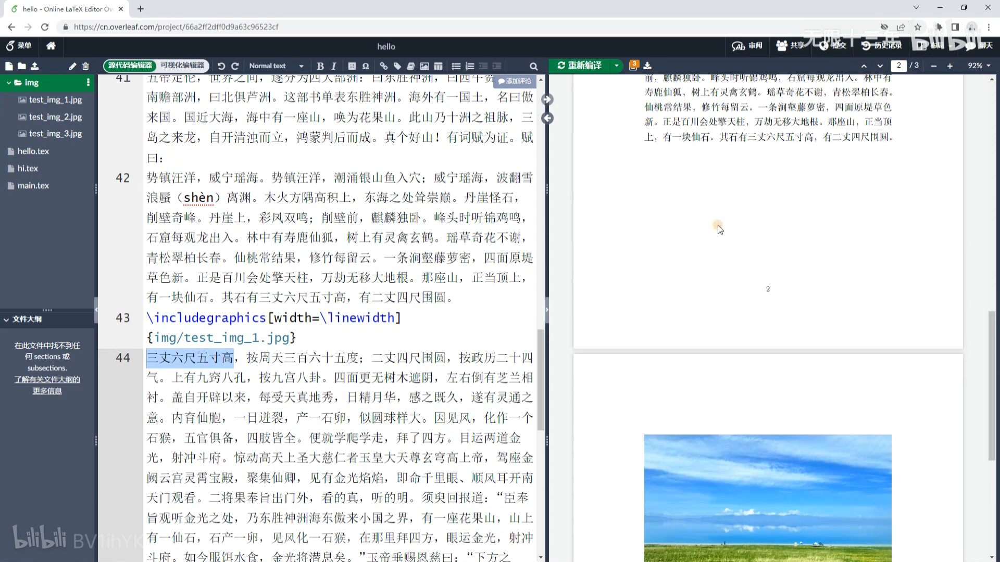

```tex
\documentclass[12pt]{ctexart}
\usepackage{graphicx} % 图片宏包
\usepackage{subcaption} % 实现多图并排主标题效果

\begin{document} 

% 浮动体，脱离文档，自动选一个合适的位置放置图片
% h：here，t：top，b：bottom，!：忽略一些限制，p：page
\begin{figure}[htbp!]
	\centering
	% \caption{一张风景} % 设置图片标题（上方）
	\includegraphics[width=\linewidth]{img/test_img_1.jpg}
	\caption{一张风景} % 设置图片标题（下方），图片会自动编号
	\label{fig:enter-lable}
\end{figure}

% 双栏排版时跨栏排版，位置只能选t或b
\begin{figure*}[tb]
	\centering
	% \caption{一张风景} % 设置图片标题（上方）
	\includegraphics[width=\linewidth]{img/test_img_1.jpg}
	\caption{一张风景} % 设置图片标题（下方），图片会自动编号
	\label{fig:enter-lable}
\end{figure*}

% 多图并排共用标题
\begin{figure}
	\centering
	\includegraphics[width=0.4\linewidth]{img/test_img_2.jpg}
	\hspace{2em} % \hfill
	\includegraphics[width=0.4\linewidth]{img/test_img_3.jpg} \\
	\vspace{1em}
	\includegraphics[width=\linewidth]{img/test_img_1.jpg}
	\caption{Caption}
	\label{fig:enter-lable}
\end{figure}

% 多图并排单独标题
\begin{figure}
	\centering
	\begin{minipage}{0.4\linewidth}
		\includegraphics[width=\linewidth]{img/test_img_2.jpg}
		\capiton{并排标题1}
	\end{minipage}
	\hfill
	\begin{minipage}{0.4\linewidth}
		\includegraphics[width=\linewidth]{img/test_img_3.jpg}
		\capiton{并排标题2}
	\end{minipage}
\end{figure}

% 多图并排主标题+小标题
\begin{figure}
	\centering
	\begin{subfigure}{0.4\linewidth}
		\includegraphics[width=\linewidth]{img/test_img_2.jpg}
		\capiton{子标题1}
	\end{subfigure} \hspace{2em}
	\begin{subfigure}{0.4\linewidth}
		\includegraphics[width=\linewidth]{img/test_img_3.jpg}
		\capiton{子标题2}
	\end{subfigure}	\\ \vspace{1em}
	\begin{subfigure}{0.4\linewidth}
		\includegraphics[width=\linewidth]{img/test_img_1.jpg}
		\capiton{子标题3}
	\end{subfigure}	
	\caption{大标题}
	\label{fig:enter-lable}
\end{figure}

\end{document}
```

## 17. 图片引用

```tex
\documentclass[12pt]{ctexart}
\usepackage{graphicx} % 图片宏包
\usepackage{subcaption} % 实现多图并排主标题效果
\usepackage[hidelinks]{hyperref} % 交叉引用，并隐藏颜色和边框
\renewcommand{\figureautorefname}{图} % 将autoref中的“Figure”改为“图”

\begin{document} 

\begin{figure}
	\centering
	\begin{subfigure}{0.4\linewidth}
		\includegraphics[width=\linewidth]{img/test_img_2.jpg}
		\capiton{子标题1}
	\end{subfigure} \hspace{2em}
	\begin{subfigure}{0.4\linewidth}
		\includegraphics[width=\linewidth]{img/test_img_3.jpg}
		\capiton{子标题2}
	\end{subfigure}	\\ \vspace{1em}
	\begin{subfigure}{0.4\linewidth}
		\includegraphics[width=\linewidth]{img/test_img_1.jpg}
		\capiton{子标题3}
	\end{subfigure}	
	\caption{大标题}
	\label{fig:fig4} % 保证每个label里面内容唯一，相当于身份证号
\end{figure}

\newpage
% 引用图片
根据图\ref{fig:fig4}可以得到
根据\autoref{fig:fig4}可以得到
% 引用图片所在的页码
\pageref{fig:fig4} 

\end{document}
```

## 18. 有序列表无序列表描述环境

```tex
\documentclass{ctexart}

\begin{document}
\Large
{\heiti 我这一天就干三件事：}

% 无序列表
\begin{itemize}
    \item 吃饭
    % \item[*] 吃饭 % 可替换为自己的修饰符
    \begin{itemize}
    	\item 吃早饭
        \begin{itemize}
            \item 喝牛奶
            \item 吃面条
        \end{itemize}
        \item 吃午饭
        \item 吃晚饭
    \end{itemize}

    \item 睡觉
    \item 打豆豆
\end{itemize}

% 有序列表
\begin{enumerate}
    \item 吃饭
    \begin{enumerate}
        \item 吃早饭
        \begin{enumerate}
            \item 喝牛奶
            \item 吃面条
        \end{enumerate}
        \item 吃午饭
        \item 吃晚饭
    \end{enumerate}
    \item 睡觉
    \item 打豆豆
\end{enumerate}

% 解释说明
\begin{description}
    \item[吃饭] 为了活下去把食物放进肚子里
    \item[吃饭] 为了活下去把食物放进肚子里
    \item[吃饭] 为了活下去把食物放进肚子里
    \item[吃饭] 为了活下去把食物放进肚子里
\end{description}

\end{document}
```

## 19. 一些空格与填充

```tex
\documentclass{ctexart}
\parindent = 0pt

\begin{document}
\Large
% \hspace \vspace
% \thinspace \, \negthinspace \enspace \nobreakspace ~ % 这一行的不太好用
% \quad \qquad \enskip \ % 注意最后是/+空格
% \hfill \vfill \stretch{} \hrulefill \dotfill

% 基准：三个盒子紧挨着，没有额外水平间距
\fbox{123}\fbox{456}\fbox{789} \\

% 正负的1em水平空白
\fbox{123}\hspace{1em}\fbox{456}\fbox{789} \\
\fbox{123}\hspace{-1em}\fbox{456}\fbox{789} \\

% \quad为1em的水平空白
\fbox{123}\hspace{1em}\fbox{456}\fbox{789} \\
\fbox{123}\quad\fbox{456}\fbox{789} \\

% \qquad为2em的水平空白
\fbox{123}\hspace{2em}\fbox{456}\fbox{789} \\
\fbox{123}\qquad\fbox{456}\fbox{789} \\

% \enskip为0.5em的水平空白
\fbox{123}\hspace{0.5em}\fbox{456}\fbox{789} \\
\fbox{123}\enskip\fbox{456}\fbox{789} \\

% 直接输入多个普通空格（在文本模式下会被当作一个空格）
\fbox{123}\ \ \ \ \ \ \fbox{456}\fbox{789} \\

% \hfill是可伸缩的水平填充，把后面的内容推到行末
\fbox{123}\hfill\fbox{456}\fbox{789} \\
% 两个\hfill将内容均匀分布到整行
\fbox{123}\hfill\fbox{456}\hfill\fbox{789} \\

% \vfill是可伸缩的竖直填充，把下面内容推到页面底部
\fbox{123}\fbox{456}\fbox{789} \\
\vfill
\fbox{123}\fbox{456}\fbox{789} \\

% \hrulefill用横线填满可用水平空间，\dotfill用点线填满可用水平空间
\fbox{123}\hrulefill\fbox{456}\dotfill\fbox{789} \\

% 使用stretch的可伸缩空白，权重相同（1:1:1）
\fbox{123}\hspace{\stretch{1}}\fbox{456}\hspace{\stretch{1}}\fbox{789}
\hspace{\stretch{1}}\fbox{789} \\
% 不同stretch权重（1:2:3），空白按比例分配
\fbox{123}\hspace{\stretch{1}}\fbox{456}\hspace{\stretch{2}}\fbox{789}
\hspace{\stretch{3}}\fbox{789} \\

\end{document}
```

## 20. 简单表格 - tabular

```tex
\documentclass[12pt]{ctexart}

\begin{document}

% \begin{tabular}[外对齐]{列格式}
% l c r p{4em} *{重复次数}{重复内容}
% t m b

前面
\begin{tabular}[b]{*{5}{|c}|} % {|c|c|c|c|c|}
    \hline
    姓名   & 面试 & 理论知识 & 上机考试 & 考评结果 \\
    \hline
    冯宝宝 & 85   & 90       & 85       & 合格     \\
    \hline
    张楚岚 & 90   & 55       & 60       & 不合格   \\
    \hline
    张灵玉 & 90   & 82       & 75       & 合格     \\
    \hline
    诸葛青 & 75   & 90       & 58       & 不合格   \\
    \hline
\end{tabular}
后面

\end{document}
```

## 21. 表格浮动环境与表格引用

自动补全的表格浮动环境代码：

```tex
\begin{table}[]
    \centering
    \begin{tabular}{c|c}
         &  \\
         & 
    \end{tabular}
    \caption{Caption}
    \label{tab:placeholder}
\end{table}
```

```tex
\documentclass[12pt]{ctexart}
\usepackage[hidelinks]{hyperref} % 使用autoref
\renewcommand{\tableautorefname}{表} % 将autoref中的“Table”改为“表”

\begin{document}
\begin{table}[htbp]
    \centering
    \caption{考评成绩} % 标题习惯放上方
	\begin{tabular}[b]{*{5}{|c}|} 
	    \hline
	    姓名   & 面试 & 理论知识  & 上机考试  & 考评结果 \\
	    \hline
	    冯宝宝 & 85   & 90       & 85       & 合格     \\
	    \hline
	    张楚岚 & 90   & 55       & 60       & 不合格   \\
	    \hline
	    张灵玉 & 90   & 82       & 75       & 合格     \\
	    \hline
	    诸葛青 & 75   & 90       & 58       & 不合格   \\
	    \hline
	\end{tabular}   
    \label{tab:exam_data}
\end{table}

\newpage

根据表\ref{tab:exam_data}可得
根据\autoref{tab:exam_data}可得 % 可点击跳转

\end{document}
```

## 22. 一些表格样式

```tex
\documentclass[12pt]{ctexart}
\usepackage[hidelinks]{hyperref}
\usepackage{diagbox} % 表头斜线
\usepackage{multirow} % 单元格跨多行

\renewcommand{\tableautorefname}{表} 

\begin{document}

% 初始表
\begin{table}[htbp]
    \centering
    \caption{考评成绩} 
	\begin{tabular}[b]{*{5}{|c}|} 
	    \hline
	    姓名   & 面试 & 理论知识  & 上机考试  & 考评结果 \\
	    \hline
	    冯宝宝 & 85   & 90       & 85       & 合格     \\
	    \hline
	    张楚岚 & 90   & 55       & 60       & 不合格   \\
	    \hline
	    张灵玉 & 90   & 82       & 75       & 合格     \\
	    \hline
	    诸葛青 & 75   & 90       & 58       & 不合格   \\
	    \hline
	\end{tabular}   
    \label{tab:exam_data}
\end{table}

% \cline{} 局部横线
% 不建议加花里胡哨的格式，修改样式对数据的侵入太大，尽量保持整洁
% 黑体：\textbf用于英文加粗，中文变为黑体，或用\heiti
\begin{table}[htbp]
    \centering
    \caption{考评成绩} 
	\begin{tabular}[b]{*{5}{|c}|} 
	    \hline
	    \diagbox{姓名}{分数}{内容}   & \textbf{面试} & \heiti 理论知识
	     & \heiti 上机考试 & \heiti 考评结果 \\
	    \cline{1-5} 
	    冯宝宝 & 85   & 90       & 85       & 合格     \\
	    \hline
	    \kaishu 张楚岚 & 90   & 55       & 60       & 不合格   \\
	    \hline
	    张灵玉 & 90   & 82       & 75       & 合格     \\
	    \hline
	    诸葛青 & 75   & 90       & 58       & 不合格   \\
	    \hline
	\end{tabular}   
    \label{tab:exam_data}
\end{table}

% 合并单元格
% \multirow{合并数量}{合并宽度，*表示根据内容调整宽度}{合并后内容}
% \multicolumn{合并数量}{合并后格式，可写lcr或宽度p}{合并后内容} 
\begin{table}[htbp]
    \centering
    \caption{考评成绩} 
	\begin{tabular}[b]{*{5}{|c}|} 
	    \hline
	    \multirow{2}{*}{姓名}   & \multicolumn{3}{c|}{考试内容}  
	    & \multirow{2}{*}{考评结果} \\
	    \cline{2-4}
	       & 面试 & 理论知识  & 上机考试  &  \\
	    \hline
	    冯宝宝 & 85   & 90       & 85       & 合格     \\
	   
	    张楚岚 & 90   & 55       & 60       & 不合格   \\
	    
	    张灵玉 & 90   & 82       & 75       & 合格     \\
	    
	    诸葛青 & 75   & 90       & 58       & 不合格   \\
	    \hline
	\end{tabular}   
    \label{tab:exam_data}
\end{table}

\end{document}
```

## 23. 三线表

```tex
\documentclass[12pt]{ctexart}
\usepackage[hidelinks]{hyperref} 
\usepackage{diagbox} 
\usepackage{multirow} 
\usepackage{booktabs} % 三线表

\renewcommand{\tableautorefname}{表} 

\begin{document}
\begin{table}[htbp]
    \centering
    \caption{考评成绩} 
	\begin{tabular}[b]{*{5}{c}} 
	    \toprule % 可指定宽度 \toprule[2pt]
	    姓名   & 面试 & 理论知识  & 上机考试  & 考评结果 \\
	    \midrule
	    冯宝宝 & 85   & 90       & 85       & 合格     \\
		\cmidrule{2-4} \morecmidrules \cmidrule{2-4}
	    张楚岚 & 90   & 55       & 60       & 不合格   \\
     	\specialrule{1pt}{2em}{1em}
	    张灵玉 & 90   & 82       & 75       & 合格     \\

	    诸葛青 & 75   & 90       & 58       & 不合格   \\
	    \bottomrule
	\end{tabular}   
    \label{tab:exam_data}
\end{table}

\end{document}
```

## 24. 表格自动变宽 - tabularx

```tex
\documentclass[12pt]{ctexart}
\usepackage[hidelinks]{hyperref} 
\usepackage{diagbox} 
\usepackage{multirow} 
\usepackage{booktabs}
\usepackage{tabularx} % 可变宽表格

\renewcommand{\tableautorefname}{表} 
% 自定义命令
\newcommand{\RC}{\centering\arraybackslash}
\newcommand{\RL}{\raggedleft\arraybackslash}
\newcommand{\RR}{\raggedright\arraybackslash}

\begin{document}
\begin{table}[htbp]
    \centering
    \caption{考评成绩} 
	\begin{tabularx}{\linewidth}{
	|>{\RC}X| % 居中
	> {\RL}X| % 靠右
	> {\RC}X| 
	> {\RC}X| 
	> {\RR}X| % 靠左
	} % 至少有一个为X，且用X列来平分
	    \hline
	    姓名   & 面试 & 理论知识  & 上机考试  & 考评结果 \\
	    \hline
	    冯宝宝 & 85   & 90       & 85       & 合格     \\
	    \hline
	    张楚岚 & 90   & 55       & 60       & 不合格   \\
	    \hline
	    张灵玉 & 90   & 82       & 75       & 合格     \\
	    \hline
	    诸葛青 & 75   & 90       & 58       & 不合格   \\
	    \hline
	\end{tabularx}   
    \label{tab:exam_data}
\end{table}

\end{document}
```

## 25. 新式表格 - tabularray

!!! note "查看文档"

	在线查看：https://texdoc.org/serve/tabularray/0
	
	本地查看：打开命令行，输入 texdoc tabularray

```tex
\documentclass[12pt]{ctexart}
\usepackage{tabularray} % 新一代表格宏包(Latex3)

\begin{document}
% tabular环境
\begin{table}[htbp]
    \centering
    \caption{考评成绩} % 标题习惯放上方
	\begin{tabular}{*{5}{|c}|} 
	    \hline
	    姓名   & 面试 & 理论知识  & 上机考试  & 考评结果 \\
	    \hline
	    冯宝宝 & 85   & 90       & 85       & 合格     \\
	    \hline
	    张楚岚 & 90   & 55       & 60       & 不合格   \\
	    \hline
	    张灵玉 & 90   & 82       & 75       & 合格     \\
	    \hline
	    诸葛青 & 75   & 90       & 58       & 不合格   \\
	    \hline
	\end{tabular}   
    \label{tab:exam_data}
\end{table}

% tblr环境（上下左右）
\begin{table}[htbp]
    \centering
    \caption{考评成绩} 
    % \SetTblrInner{rowsep=0pt} % 取消行间竖直空白，效果和tabluar一样
	\begin{tblr}{|c|c|c|c|c|} 
	    \hline
	    姓名   & 面试 & 理论知识  & 上机考试  & 考评结果 \\
	    \hline
	    冯宝宝 & 85   & 90       & 85       & 合格     \\
	    \hline
	    张楚岚 & 90   & 55       & 60       & 不合格   \\
	    \hline
	    张灵玉 & 90   & 82       & 75       & 合格     \\
	    \hline
	    诸葛青 & 75   & 90       & 58       & 不合格   \\
	    \hline
	\end{tblr}   
    \label{tab:exam_data}
\end{table}

\end{document}
```

## 26. 表格 - 换行与 Q 格式

```tex
\documentclass[12pt]{ctexart}
\usepackage{tabularray} % 新一代表格宏包(Latex3)

\begin{document}
% tabular环境
\begin{table}[htbp]
    \centering
    \caption{考评成绩} % 标题习惯放上方
	\begin{tabular}{*{5}{|c}|} 
	    \hline
	    姓名   & 面试 & 理论知识  & 上机考试  & 考评结果 \\
	    \hline
	    冯宝宝 & 85   & 90       & 85       & 合格     \\
	    \hline
	    张楚岚 & 90   & 55       & 60       & 不合格   \\
	    \hline
	    张灵玉 & 90   & 82       & 75       & 合格     \\
	    \hline
	    诸葛青 & 75   & 90       & 58       & 不合格   \\
	    \hline
	\end{tabular}   
    \label{tab:exam_data}
\end{table}

% tblr环境（上下左右）
\begin{table}[htbp]
    \centering
    \caption{考评成绩} 
    % \SetTblrInner{rowsep=0pt}
    % Q格式参数：l c r，h（head） f（foot） m，列宽度，可能会影响后面列的格式
	\begin{tblr}{|Q[c,m,5em]|Q[h,3em]|Q[r,f]|c|c|} 
	    \hline
	    姓名   & 面试 & 理论知识  & 上机考试  & 考评结果 \\
	    \hline
	    {冯宝宝 \\ 冯宝宝 \\ 冯宝宝} & 85   & 90       & 85       & 合格     \\
	    \hline
	    {张楚岚 \\ 张楚岚} & 90   & 55       & 60       & 不合格   \\
	    \hline
	    张灵玉 & 90   & 82       & 75       & 合格     \\
	    \hline
	    诸葛青 & 75   & 90       & 58       & 不合格   \\
	    \hline
	\end{tblr}   
    \label{tab:exam_data}
\end{table}

\end{document}
```

## 27. 表格 - 变宽

```tex
\documentclass[12pt]{ctexart}
\usepackage{tabularray} % 新一代表格宏包(Latex3)

\begin{document}
% tabular环境
\begin{table}[htbp]
    \centering
    \caption{考评成绩} % 标题习惯放上方
	\begin{tabular}{*{5}{|c}|} 
	    \hline
	    姓名   & 面试 & 理论知识  & 上机考试  & 考评结果 \\
	    \hline
	    冯宝宝 & 85   & 90       & 85       & 合格     \\
	    \hline
	    张楚岚 & 90   & 55       & 60       & 不合格   \\
	    \hline
	    张灵玉 & 90   & 82       & 75       & 合格     \\
	    \hline
	    诸葛青 & 75   & 90       & 58       & 不合格   \\
	    \hline
	\end{tabular}   
    \label{tab:exam_data}
\end{table}

% tblr环境（上下左右）
\begin{table}[htbp]
    \centering
    \caption{考评成绩} 
    % \SetTblrInner{rowsep=0pt}
    % c l r 数字表示比例 -1表示按内容决定宽度
	% \begin{tblr}{|X[c,2]|X[r,3]|X[c,-1]|X|c|} 
	\begin{tblr}{
		colspec = {|X[c]|X[c]|c|c|c|},
		width = 0.8\linewidth
	}
	    \hline
	    姓名   & 面试 & 理论知识  & 上机考试  & 考评结果 \\
	    \hline
	    冯宝宝 & 85   & 90       & 85       & 合格     \\
	    \hline
	    张楚岚 & 90   & 55       & 60       & 不合格   \\
	    \hline
	    张灵玉 & 90   & 82       & 75       & 合格     \\
	    \hline
	    诸葛青 & 75   & 90       & 58       & 不合格   \\
	    \hline
	\end{tblr}   
    \label{tab:exam_data}
\end{table}

\end{document}
```

## 28. 表格 - 行列设置分离

```tex
\documentclass[12pt]{ctexart}
\usepackage{tabularray} % 新一代表格宏包(Latex3)

\begin{document}
% tabular环境
\begin{table}[htbp]
    \centering
    \caption{考评成绩} % 标题习惯放上方
	\begin{tabular}{*{5}{|c}|} 
	    \hline
	    姓名   & 面试 & 理论知识  & 上机考试  & 考评结果 \\
	    \hline
	    冯宝宝 & 85   & 90       & 85       & 合格     \\
	    \hline
	    张楚岚 & 90   & 55       & 60       & 不合格   \\
	    \hline
	    张灵玉 & 90   & 82       & 75       & 合格     \\
	    \hline
	    诸葛青 & 75   & 90       & 58       & 不合格   \\
	    \hline
	\end{tabular}   
    \label{tab:exam_data}
\end{table}

% tblr环境（上下左右）
\begin{table}[htbp]
    \centering
    \caption{考评成绩} 
    % \SetTblrInner{rowsep=0pt}
	% width = 0.8\linewidth
	\begin{tblr}{
		colspec = {|Q[c]|c|c|c|c|},
		% 通过行格式设置对齐和横边框线，实现数据和样式的分离
		rowspec = {|Q[m]|Q[h]|Q[f]|Q[m]|Q[m]|} 
	}
	    
	    姓名   & 面试 & 理论知识  & 上机考试  & 考评结果 \\
	   
	    冯宝宝 & 85   & 90       & 85       & 合格     \\
	   
	    张楚岚 & 90   & 55       & 60       & 不合格   \\
	   
	    张灵玉 & 90   & 82       & 75       & 合格     \\
	    
	    诸葛青 & 75   & 90       & 58       & 不合格   \\
	    
	\end{tblr}   
    \label{tab:exam_data}
\end{table}

\end{document}
```

## 29. 表格 - 框线样式颜色

```tex
\documentclass[12pt]{ctexart}
\usepackage{tabularray} % 新一代表格宏包(Latex3)
\usepackage{xcolor} % 颜色宏包

\begin{document}
% tabular环境
\begin{table}[htbp]
    \centering
    \caption{考评成绩} % 标题习惯放上方
	\begin{tabular}{*{5}{|c}|} 
	    \hline
	    姓名   & 面试 & 理论知识  & 上机考试  & 考评结果 \\
	    \hline
	    冯宝宝 & 85   & 90       & 85       & 合格     \\
	    \hline
	    张楚岚 & 90   & 55       & 60       & 不合格   \\
	    \hline
	    张灵玉 & 90   & 82       & 75       & 合格     \\
	    \hline
	    诸葛青 & 75   & 90       & 58       & 不合格   \\
	    \hline
	\end{tabular}   
    \label{tab:exam_data}
\end{table}

% tblr环境（上下左右）
\begin{table}[htbp]
    \centering
    \caption{考评成绩} 
    % \SetTblrInner{rowsep=0pt}
	% width = 0.8\linewidth
	% rowspec = {|Q[m]|Q[h]|Q[f]|Q[m]|Q[m]|}
	\begin{tblr}{
		colspec = {ccccc},
        hlines = {2pt, dashed, blue9}, % solid dashed dotted 颜色有9种色阶
        vlines = {red}
	}
	    
	    姓名   & 面试 & 理论知识  & 上机考试  & 考评结果 \\   
	    冯宝宝 & 85   & 90       & 85       & 合格     \\  
	    张楚岚 & 90   & 55       & 60       & 不合格   \\ 
	    张灵玉 & 90   & 82       & 75       & 合格     \\   
	    诸葛青 & 75   & 90       & 58       & 不合格   \\
	    
	\end{tblr}   
    \label{tab:exam_data}
\end{table}

\end{document}
```

## 30. 表格 - 按行列绘制边框线

```tex
\documentclass[12pt]{ctexart}
\usepackage{tabularray} % 新一代表格宏包(Latex3)
\usepackage{xcolor} % 颜色宏包

\begin{document}
% tabular环境
\begin{table}[htbp]
    \centering
    \caption{考评成绩} % 标题习惯放上方
	\begin{tabular}{*{5}{|c}|} 
	    \hline
	    姓名   & 面试 & 理论知识  & 上机考试  & 考评结果 \\
	    \hline
	    冯宝宝 & 85   & 90       & 85       & 合格     \\
	    \hline
	    张楚岚 & 90   & 55       & 60       & 不合格   \\
	    \hline
	    张灵玉 & 90   & 82       & 75       & 合格     \\
	    \hline
	    诸葛青 & 75   & 90       & 58       & 不合格   \\
	    \hline
	\end{tabular}   
    \label{tab:exam_data}
\end{table}

% tblr环境（上下左右）
\begin{table}[htbp]
    \centering
    \caption{考评成绩} 
    % \SetTblrInner{rowsep=0pt}
	% h[v]1ines = {边框线样式}
	% h[v]1ines = {范围}{边框线样式} 1 1,2 2-4 - odd/even
	\begin{tblr}{
		colspec = {ccccc},
		% hlines = {1,3,5}
        hlines = {2-4}{blue},
        vlines = {2-4}{}
	}
	    
	    姓名   & 面试 & 理论知识  & 上机考试  & 考评结果 \\   
	    冯宝宝 & 85   & 90       & 85       & 合格     \\  
	    张楚岚 & 90   & 55       & 60       & 不合格   \\ 
	    张灵玉 & 90   & 82       & 75       & 合格     \\   
	    诸葛青 & 75   & 90       & 58       & 不合格   \\
	    
	\end{tblr}   
    \label{tab:exam_data}
\end{table}

\end{document}
```

## 31. 表格 - 多边框线

```tex
\documentclass[12pt]{ctexart}
\usepackage{tabularray} % 新一代表格宏包(Latex3)
\usepackage{xcolor} % 颜色宏包

\begin{document}
% tabular环境
\begin{table}[htbp]
    \centering
    \caption{考评成绩} % 标题习惯放上方
	\begin{tabular}{*{5}{|c}|} 
	    \hline
	    姓名   & 面试 & 理论知识  & 上机考试  & 考评结果 \\
	    \hline
	    冯宝宝 & 85   & 90       & 85       & 合格     \\
	    \hline
	    张楚岚 & 90   & 55       & 60       & 不合格   \\
	    \hline
	    张灵玉 & 90   & 82       & 75       & 合格     \\
	    \hline
	    诸葛青 & 75   & 90       & 58       & 不合格   \\
	    \hline
	\end{tabular}   
    \label{tab:exam_data}
\end{table}

% tblr环境（上下左右）
\begin{table}[htbp]
    \centering
    \caption{考评成绩} 
    % \SetTblrInner{rowsep=0pt}
	% h[v]1ines = {边框线样式}
	% h[v]1ines = {范围}{边框线样式} 1 1,2 2-4 - odd/even
	% h[v]1ines = {序号}{范围}{边框线样式}
	\begin{tblr}{
		colspec = {ccccc},
		hlines = {1}{-}{},
        hlines = {2}{2-4}{1pt,blue}
	}
	    
	    姓名   & 面试 & 理论知识  & 上机考试  & 考评结果 \\   
	    冯宝宝 & 85   & 90       & 85       & 合格     \\  
	    张楚岚 & 90   & 55       & 60       & 不合格   \\ 
	    张灵玉 & 90   & 82       & 75       & 合格     \\   
	    诸葛青 & 75   & 90       & 58       & 不合格   \\
	    
	\end{tblr}   
    \label{tab:exam_data}
\end{table}

\end{document}
```

## 32. 表格 - 自由绘制边框线

```tex
\documentclass[12pt]{ctexart}
\usepackage{tabularray} % 新一代表格宏包(Latex3)
\usepackage{xcolor} % 颜色宏包

\begin{document}
% tabular环境
\begin{table}[htbp]
    \centering
    \caption{考评成绩} % 标题习惯放上方
	\begin{tabular}{*{5}{|c}|} 
	    \hline
	    姓名   & 面试 & 理论知识  & 上机考试  & 考评结果 \\
	    \hline
	    冯宝宝 & 85   & 90       & 85       & 合格     \\
	    \hline
	    张楚岚 & 90   & 55       & 60       & 不合格   \\
	    \hline
	    张灵玉 & 90   & 82       & 75       & 合格     \\
	    \hline
	    诸葛青 & 75   & 90       & 58       & 不合格   \\
	    \hline
	\end{tabular}   
    \label{tab:exam_data}
\end{table}

% tblr环境（上下左右）
\begin{table}[htbp]
    \centering
    \caption{考评成绩} 
    % \SetTblrInner{rowsep=0pt}
	% h[v]1ines = {边框线样式}
	% h[v]1ines = {范围}{边框线样式} 1 1,2 2-4 - odd/even
	% h[v]1ines = {序号}{范围}{边框线样式}
	\begin{tblr}{
		colspec = {ccccc},
		% hlines = {2}{},
        hline{3,5} = {3,4}{dashed,blue},
        vline{3,5} = {3,4}{dashed,blue},
        hline{2,3} = {1}{},
        vline{1,2} = {2}{}
	}
	    
	    姓名   & 面试 & 理论知识  & 上机考试  & 考评结果 \\   
	    冯宝宝 & 85   & 90       & 85       & 合格     \\  
	    张楚岚 & 90   & 55       & 60       & 不合格   \\ 
	    张灵玉 & 90   & 82       & 75       & 合格     \\   
	    诸葛青 & 75   & 90       & 58       & 不合格   \\
	    
	\end{tblr}   
    \label{tab:exam_data}
\end{table}

\end{document}
```

## 33. 表格 - 设置行列样式

```tex
\documentclass[12pt]{ctexart}
\usepackage{tabularray} % 新一代表格宏包(Latex3)
\usepackage{xcolor} % 颜色宏包

\begin{document}
% tabular环境
\begin{table}[htbp]
    \centering
    \caption{考评成绩} % 标题习惯放上方
	\begin{tabular}{*{5}{|c}|} 
	    \hline
	    姓名   & 面试 & 理论知识  & 上机考试  & 考评结果 \\
	    \hline
	    冯宝宝 & 85   & 90       & 85       & 合格     \\
	    \hline
	    张楚岚 & 90   & 55       & 60       & 不合格   \\
	    \hline
	    张灵玉 & 90   & 82       & 75       & 合格     \\
	    \hline
	    诸葛青 & 75   & 90       & 58       & 不合格   \\
	    \hline
	\end{tabular}   
    \label{tab:exam_data}
\end{table}

% tblr环境（上下左右）
\begin{table}[htbp]
    \centering
    \caption{考评成绩} 
    % \SetTblrInner{rowsep=0pt}
	% h[v]1ines = {边框线样式}
	% h[v]1ines = {范围}{边框线样式} 1 1,2 2-4 - odd/even
	% h[v]1ines = {序号}{范围}{边框线样式}
	\begin{tblr}{
		colspec = {ccccc},
		hlines, vlines,
		% 设置所有行/列的样式
		% columns = {c,bg=cyan,fg=white,font=\kaishu\Large},
		% rows = {m}
		% 设置单独行/列的样式
		row{1} = {bg=cyan,font=\heiti\large},
		column{1} = {font=\kaishu,fg=blue}
	}
	    
	    姓名   & 面试 & 理论知识  & 上机考试  & 考评结果 \\   
	    冯宝宝 & 85   & 90       & 85       & 合格     \\  
	    张楚岚 & 90   & 55       & 60       & 不合格   \\ 
	    张灵玉 & 90   & 82       & 75       & 合格     \\   
	    诸葛青 & 75   & 90       & 58       & 不合格   \\
	    
	\end{tblr}   
    \label{tab:exam_data}
\end{table}

\end{document}
```

## 34. 表格 - 单元格合并与样式

```tex
\documentclass[12pt]{ctexart}
\usepackage{tabularray} % 新一代表格宏包(Latex3)
\usepackage{xcolor} % 颜色宏包

\begin{document}
% tabular环境
\begin{table}[htbp]
    \centering
    \caption{考评成绩} % 标题习惯放上方
	\begin{tabular}{*{5}{|c}|} 
	    \hline
	    姓名   & 面试 & 理论知识  & 上机考试  & 考评结果 \\
	    \hline
	    冯宝宝 & 85   & 90       & 85       & 合格     \\
	    \hline
	    张楚岚 & 90   & 55       & 60       & 不合格   \\
	    \hline
	    张灵玉 & 90   & 82       & 75       & 合格     \\
	    \hline
	    诸葛青 & 75   & 90       & 58       & 不合格   \\
	    \hline
	\end{tabular}   
    \label{tab:exam_data}
\end{table}

% tblr环境（上下左右）
\begin{table}[htbp]
    \centering
    \caption{考评成绩} 
    % \SetTblrInner{rowsep=0pt}
	% h[v]1ines = {边框线样式}
	% h[v]1ines = {范围}{边框线样式} 1 1,2 2-4 - odd/even
	% h[v]1ines = {序号}{范围}{边框线样式}
	% cell{行}{列} = {单元格样式}
	% cell{行}{列} = {合并数}{单元格样式}
	% r = N，c = M
	\begin{tblr}{
		colspec = {ccccc},
		hlines, vlines,
		% cells = {cyan},
		% cell{1,5}{2-4} = {cyan},
		cell{1}{1} = {r=2}{},
		cell{1}{5} = {r=2}{},
		cell{1}{2} = {c=3}{},
		cell{3}{2} = {c=3, r=4}{}
	}
	
	    姓名   & 考试内容 & 理论知识  & 上机考试  & 考评结果 \\
	    姓名   & 面试 & 理论知识  & 上机考试  & 考评结果 \\   
	    冯宝宝 & 85   & 90       & 85       & 合格     \\  
	    张楚岚 & 90   & 55       & 60       & 不合格   \\ 
	    张灵玉 & 90   & 82       & 75       & 合格     \\   
	    诸葛青 & 75   & 90       & 58       & 不合格   \\
	    
	\end{tblr}   
    \label{tab:exam_data}
\end{table}

\end{document}
```

## 35. tabularray 与三线表

```tex
\documentclass[12pt]{ctexart}
\usepackage{tabularray} % 新一代表格宏包(Latex3)
\usepackage{xcolor} % 颜色宏包
\UseTblrLibrary{booktabs} % tabularray的三线表

\begin{document}
% tabular环境
\begin{table}[htbp]
    \centering
    \caption{考评成绩} % 标题习惯放上方
	\begin{tabular}{*{5}{|c}|} 
	    \hline
	    姓名   & 面试 & 理论知识  & 上机考试  & 考评结果 \\
	    \hline
	    冯宝宝 & 85   & 90       & 85       & 合格     \\
	    \hline
	    张楚岚 & 90   & 55       & 60       & 不合格   \\
	    \hline
	    张灵玉 & 90   & 82       & 75       & 合格     \\
	    \hline
	    诸葛青 & 75   & 90       & 58       & 不合格   \\
	    \hline
	\end{tabular}   
    \label{tab:exam_data}
\end{table}

% tblr环境（上下左右）
\begin{table}[htbp]
    \centering
    \caption{考评成绩} 
    % \SetTblrInner{rowsep=0pt}
	% h[v]1ines = {边框线样式}
	% h[v]1ines = {范围}{边框线样式} 1 1,2 2-4 - odd/even
	% h[v]1ines = {序号}{范围}{边框线样式}
	% cell{行}{列} = {单元格样式}
	% cell{行}{列} = {合并数}{单元格样式}
	% r = N，c = M
	\begin{tblr}{
		colspec = {ccccc},
	}
	
	    \toprule
	    姓名   & 面试 & 理论知识  & 上机考试  & 考评结果 \\ 
	    \midrule  
	    冯宝宝 & 85   & 90       & 85       & 合格     \\  
	    张楚岚 & 90   & 55       & 60       & 不合格   \\ 
	    张灵玉 & 90   & 82       & 75       & 合格     \\   
	    诸葛青 & 75   & 90       & 58       & 不合格   \\
	    \bottomrule
	    
	\end{tblr}   
    \label{tab:exam_data}
\end{table}

\end{document}
```

## 36. 长表格 - longtblr

```tex
\documentclass[12pt]{ctexart}
\usepackage{tabularray} % 新一代表格宏包(Latex3)
\usepackage{xcolor} % 颜色宏包
\UseTblrLibrary{booktabs} % tabularray的三线表

\begin{document}
% tabular环境
\begin{table}[htbp]
    \centering
    \caption{考评成绩} % 标题习惯放上方
	\begin{tabular}{*{5}{|c}|} 
	    \hline
	    姓名   & 面试 & 理论知识  & 上机考试  & 考评结果 \\
	    \hline
	    冯宝宝 & 85   & 90       & 85       & 合格     \\
	    \hline
	    张楚岚 & 90   & 55       & 60       & 不合格   \\
	    \hline
	    张灵玉 & 90   & 82       & 75       & 合格     \\
	    \hline
	    诸葛青 & 75   & 90       & 58       & 不合格   \\
	    \hline
	\end{tabular}   
    \label{tab:exam_data}
\end{table}

\DefTblrTemplate{contfoot-text}{chs}{接下页\dots}
\SetTblrTemplate{contfoot-text}{chs}
\DefTblrTemplate{conthead-text}{chs}{（续表）}
\SetTblrTemplate{conthead-text}{chs}

% 不需要包裹在table里面
\begin{longtblr}[
  caption = {一个很长的表格},
  label = {tab:long_tab}
]{
  colspec = {cccc},
  hlines, vlines,
  rowhead = 1 % 表头行的行数为1
}
员工号 & 工资 & 起始日期 & 终止日期 \\
10001 & 60117 & 26/6/1986 & 26/6/1987 \\
10001 & 62102 & 26/6/1987 & 25/6/1988 \\
10001 & 66074 & 25/6/1988 & 25/6/1989 \\
10001 & 66596 & 25/6/1989 & 25/6/1990 \\
10001 & 66961 & 25/6/1990 & 25/6/1991 \\
10001 & 71046 & 25/6/1991 & 24/6/1992 \\
10001 & 74333 & 24/6/1992 & 24/6/1993 \\
10001 & 75286 & 24/6/1993 & 24/6/1994 \\
10001 & 75994 & 24/6/1994 & 24/6/1995 \\
10001 & 76884 & 24/6/1995 & 23/6/1996 \\
10001 & 80013 & 23/6/1996 & 23/6/1997 \\
10001 & 81025 & 23/6/1997 & 23/6/1998 \\
10001 & 81097 & 23/6/1998 & 23/6/1999 \\
10001 & 84917 & 23/6/1999 & 22/6/2000 \\
10001 & 85112 & 22/6/2000 & 22/6/2001 \\
10001 & 85097 & 22/6/2001 & 22/6/2002 \\
10001 & 88958 & 22/6/2002 & 1/1/9999 \\
10002 & 65828 & 3/8/1996 & 3/8/1997 \\
10002 & 60117 & 26/6/1986 & 26/6/1987 \\
10002 & 62102 & 26/6/1987 & 25/6/1988 \\
10002 & 66074 & 25/6/1988 & 25/6/1989 \\
10002 & 66596 & 25/6/1989 & 25/6/1990 \\
10002 & 66961 & 25/6/1990 & 25/6/1991 \\
10002 & 71046 & 25/6/1991 & 24/6/1992 \\
10002 & 74333 & 24/6/1992 & 24/6/1993 \\
10002 & 75286 & 24/6/1993 & 24/6/1994 \\
10002 & 75994 & 24/6/1994 & 24/6/1995 \\
10002 & 76884 & 24/6/1995 & 23/6/1996 \\
10002 & 80013 & 23/6/1996 & 23/6/1997 \\
10002 & 81025 & 23/6/1997 & 23/6/1998 \\
10002 & 81097 & 23/6/1998 & 23/6/1999 \\
10002 & 84917 & 23/6/1999 & 22/6/2000 \\
10002 & 85112 & 22/6/2000 & 22/6/2001 \\
10002 & 85097 & 22/6/2001 & 22/6/2002 \\
10002 & 88958 & 22/6/2002 & 1/1/9999 \\
10002 & 65828 & 3/8/1996 & 3/8/1997 \\
\end{longtblr}

\end{document}
```

## 37. 横向表格 （宽表）

```tex
\documentclass[12pt]{ctexart}
\usepackage{tabularray} % 新一代表格宏包(Latex3)
\usepackage{xcolor} % 颜色宏包
\UseTblrLibrary{booktabs} % tabularray的三线表
\usepackage{rotating} % 旋转表格

\begin{document}

\begin{sidewaystable}[htbp]
  \centering
  \caption{宽表格}
  \begin{tblr}{
    colspec = {*{23}{c}},
    hlines
  }
    & 2000 & 2001 & 2002 & 2003 & 2004 & 2005 &
      2006 & 2007 & 2008 & 2009 & 2010 & 2011 & 2012
      & 2013 & 2014 \\
    冯宝宝 & 699 & 355 & 264 & 313 & 623 & 488 & 192 &
      436 & 137 & 400 & 500 & 987 & 464 & 824 & 270 \\
    张楚岚 & 745 & 453 & 559 & 328 & 281 & 264 & 415 &
      850 & 459 & 231 & 948 & 859 & 795 & 393 & 207 \\
    张灵玉 & 237 & 608 & 802 & 822 & 601 & 585 & 953 &
      562 & 801 & 378 & 845 & 609 & 586 & 918 & 525 \\
    王也 & 135 & 841 & 838 & 104 & 542 & 441 & 278 &
      326 & 653 & 464 & 515 & 531 & 739 & 750 & 981
  \end{tblr}
  \label{tab:my_label}
\end{sidewaystable}

\end{document}
```

## 38. 关于表格的一些补充

表格生成工具：

（1） Texstudio：向导 (W) → Tabular 表格向导 (B)

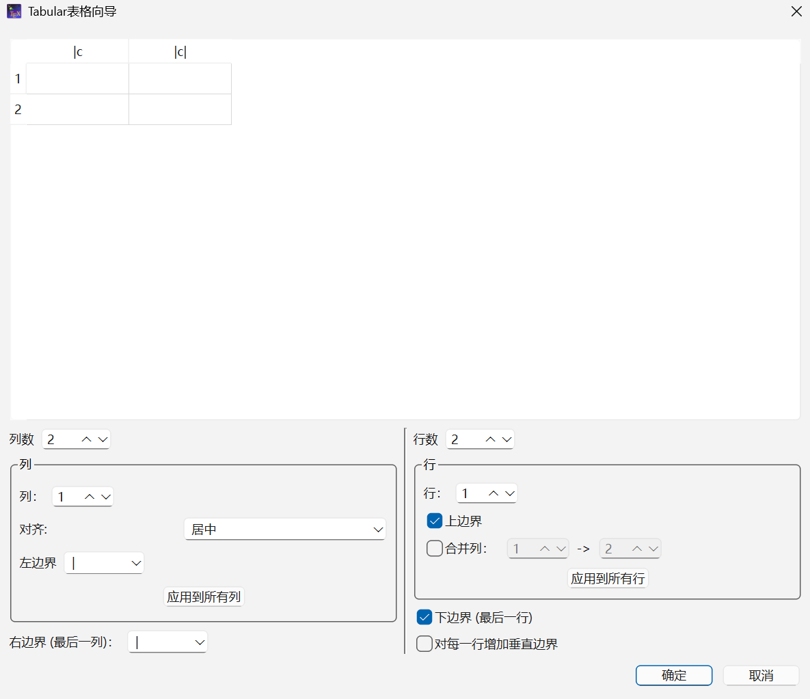
（2） 在线网站，如 [Advanced Table Editor]( https://www.latex-tables.com/)

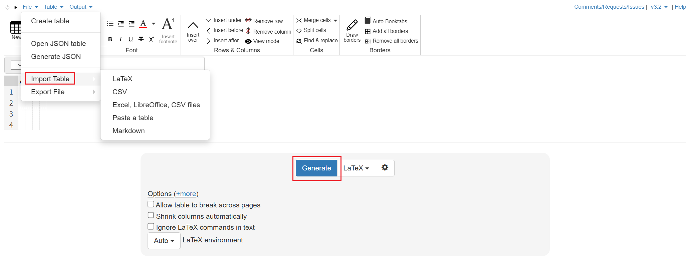
## 39. 数学模式与公式引用

辅助：

（1） Texstudio

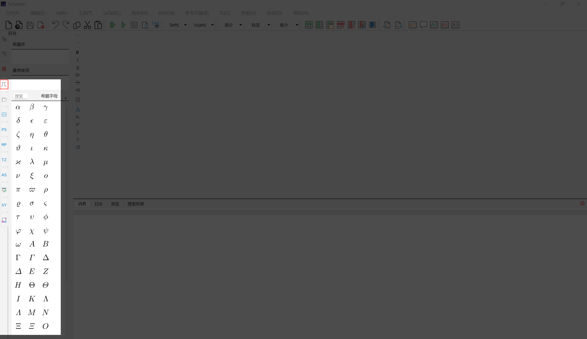
（2） 在线网站，如 [在线Latex公式编辑器](https://www.latexlive.com/)

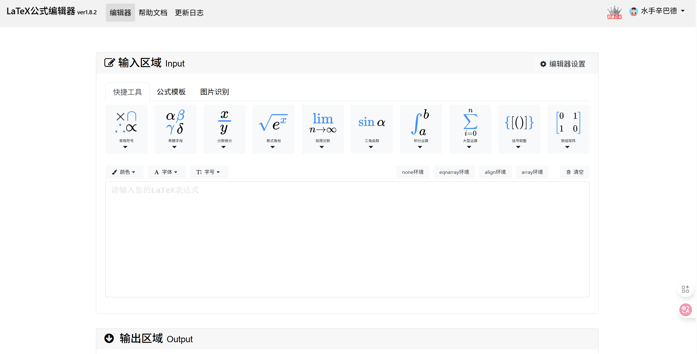
```tex
\documentclass[12pt]{ctexart}
\usepackage{amsmath} % 美观公式
\usepackage[hidelinks]{hyperref}

\renewcommand{\equationautorefname}{公式}

\begin{document}

% 行内公式
勾股定理 $a^2+b^2=c^2$ 的应用

% 行间公式
勾股定理 \[
  a^2+b^2=c^2
\] 的应用

勾股定理
\begin{equation}
  \label{eq:gougu}
  a^2+b^2=c^2
\end{equation}

\begin{equation}
  a^2+b^2=c^2
\end{equation}

由公式\ref{eq:gougu}可得。。。

由公式\eqref{eq:gougu}可得。。

由\autoref{eq:gougu}可得。。

\end{document}
```

## 40. 分式与根式

{ width="400" }

```tex
\documentclass[12pt]{ctexart}
\usepackage{amsmath} 

\begin{document}

分式与根式

$\dfrac{x+y}{x-y}$ % 显示型分式

\[
\frac{23}{45} \quad 4\frac{2}{3} \quad \frac{x+y}{x-y}
\]

\[
\dfrac{\dfrac{x+y}{x-y}}{x^2+y^2}
\]

\[
\sqrt{4} \quad \sqrt{x+2} \quad \sqrt[3]{8} \quad
\sqrt[4]{a+b^2} \quad \sqrt[n]{\dfrac{x^2 + \sqrt{2}}{x+y}}
\]

\end{document}
```

## 41 .公式 - 上下标

符号表：《 Ishort-zh-cn 》 p54


```tex
\documentclass[12pt]{ctexart}
\usepackage{amsmath} 

\begin{document}

上下标

\[
A_n^m \quad A^m_n \quad A_{ij} \quad f(x)=e^{x^2+x+3} \quad 45^{\circ} \quad
(e^x)''' = (e^x)'' = (e^x)' = e^x \quad f^{(n)}(x)
\]

\end{document}
```

## 42. 公式 - 上下线

{ width="350" }

```tex
\documentclass[12pt]{ctexart}
\usepackage{amsmath} 

\begin{document}

上下线

\[
\vec{a} \cdot \vec{b} \quad \boldsymbol{a} \times
\boldsymbol{b} \quad \overrightarrow{AB} \cdottex
\overrightarrow{CD} \quad \overline{AB} \quad
\underline{CD} \quad \bar{x}_0 \quad \hat{a}
\]

\[
\overbrace{(a + a + \cdots + a)}^{\text{$n$个$a$}} \times
\underbrace{(b + b + \cdots + b)}_{\text{$m$个$b$}}
\]

\end{document}
```

## 43. 公式 - 求和与公式样式调整

{ width="350" }

```tex
\documentclass[12pt]{ctexart}
\usepackage{amsmath} 
\usepackage{mathtools}

\begin{document}

求和 $s_n = \sum\limits_{i=0}^{\infty} a_n$

求和 $\displaystyle s_n = \sum_{i=0}^{\infty} a_n$

\[
s_n = \sum_{i=0}^{\infty} a_n \quad
\smashoperator{\sum_{\substack{0<i<n \\ 0<j<mdfjsdjflksdjklij}}} A_{ij}
\]

\[
\hat{b} = \dfrac{\displaystyle \sum_{i=1}^{n}(x_i - \bar{x})(y_i - \bar{y})}
{\displaystyle \sum_{i=1}^{n}(x_i - \bar{x})^2}
\]

\[
\hat{a} = \bar{y} - \hat{b}\bar{x}
\]

\[
\hat{y} = \hat{b}x + \hat{a}
\]

\[
\hat{\mathstrut a} \ \hat{\mathstrut b} \ \hat{\mathstrut y}
\quad \vec{\mathstrut a} \cdot \vec{\mathstrut b} \quad
\sqrt{\mathstrut b} \ \sqrt{\mathstrut y}
\]

\[
\sqrt[\uproot{12}\leftroot{-3}3]{\dfrac{x+y}{x-y}}
\]

\end{document}
```

## 44. 公式 - 积分

{ width="350" }

```tex
\documentclass[12pt]{ctexart}
\usepackage{amsmath} 
\usepackage{mathtools}

\newcommand{\di}{\mathrm{d}}

\begin{document}

$\lim\limits_{x \to 0} \dfrac{\sin x}{x} = 0$

极限与积分

\[
\lim_{x \to 0} \dfrac{\sin x}{x} = 0
\quad
\lim_{n \to \infty} \left(1 + \dfrac{1}{n}\right)^n = e
\]

\[
\int x \, \di x
\quad
\int_{0}^{1} \sqrt{1 - x^2} \, \di x
\quad
\iint\limits_{S} \sqrt{x^2 + y^2} \, \di x \, \di y
\]

\[
\boxed{
\oint_{\Gamma} P(x, y, z)\di x + Q(x, y, z)\di y + R(x, y, z)\di z
}
\]

\[
\oint_{L} P\di x + Q \di y = \iint\limits_{D}
(\dfrac{\partial Q}{\partial x} - \dfrac{\partial P}{\partial y}) \di x \di y
\]

\[
\left (
\dfrac{\partial Q}{\partial x} - \dfrac{\partial P}{\partial y}
\right )
\]

\[
\left [
\dfrac{\partial Q}{\partial x} - \dfrac{\partial P}{\partial y}
\right ]
\]

\[
\left \{
\dfrac{\partial Q}{\partial x} - \dfrac{\partial P}{\partial y}
\right \}
\]

\[
\left \{
\dfrac{\partial Q}{\partial x} - \dfrac{\partial P}{\partial y}
\right .
\]

\[
\left .
\dfrac{\partial Q}{\partial x} - \dfrac{\partial P}{\partial y}
\right \}
\]

\[
\left |
\dfrac{\partial Q}{\partial x} - \dfrac{\partial P}{\partial y}
\right |
\]

\end{document}
```

## 45. 公式 - 矩阵

{ width="450" }

```tex
\documentclass[12pt]{ctexart}
\usepackage{amsmath} 
\usepackage{mathtools}
\usepackage{xcolor}

\usepackage{tabularray}   
\UseTblrLibrary{amsmath}  % tabularray的amsmath
 
\begin{document}

矩阵 % matrix bmatrix vmatrix pmatrix Bmatrix Vmatrix

\[
A = \left (
\begin{array}{rrr} % tabular
  11.11 & 12 & 13 \\
  21 & -22 & 23 \\
  31 & 32 & -33.33 \\
\end{array} \right )
\]

\[
M =
\begin{matrix}
  11 & 12 & 13 \\
  21 & 22 & 23 \\
  31 & 32 & 33
\end{matrix}
\quad
bM =
\begin{bmatrix}
  11 & 12 & 13 \\
  21 & 22 & 23 \\
  31 & 32 & 33
\end{bmatrix}
\quad
vM =
\begin{vmatrix}
  11 & 12 & 13 \\
  21 & 22 & 23 \\
  31 & 32 & 33
\end{vmatrix}
\]

\[
pM =
\begin{pmatrix}
  11 & 12 & 13 \\
  21 & 22 & 23 \\
  31 & 32 & 33
\end{pmatrix}
\quad
BM =
\begin{Bmatrix}
  11 & 12 & 13 \\
  21 & 22 & 23 \\
  31 & 32 & 33
\end{Bmatrix}
\quad
VM =
\begin{Vmatrix}
  11 & 12 & 13 \\
  21 & 22 & 23 \\
  31 & 32 & 33
\end{Vmatrix}
\]

\[
A =
\begin{pmatrix}
  \dfrac{1}{3} & -\dfrac{1}{4} & \dfrac{1}{5} \\
  \dfrac{11}{13} & -\dfrac{11}{14} & \dfrac{11}{15} \\
  \dfrac{1}{3} & \dfrac{1}{4} & -\dfrac{1}{5}
\end{pmatrix}
\quad
A =
\begin{+pmatrix}
  \dfrac{1}{3} & -\dfrac{1}{4} & \dfrac{1}{5} \\
  \dfrac{11}{13} & -\dfrac{11}{14} & \dfrac{11}{15} \\
  \dfrac{1}{3} & \dfrac{1}{4} & -\dfrac{1}{5}
\end{+pmatrix}
A =
\begin{+pmatrix}[cells=r, row{2}={blue9}]
  \dfrac{1}{3} & -\dfrac{1}{4} & \dfrac{1}{5} \\
  \dfrac{11}{13} & -\dfrac{11}{14} & \dfrac{11}{15} \\
  \dfrac{1}{3} & \dfrac{1}{4} & -\dfrac{1}{5}
\end{+pmatrix}
\]

\[
A=
\begin{pmatrix}
  a_{11} & a_{12} & \cdots & a_{1n} \\
  a_{21} & a_{22} & \cdots & a_{2n} \\
  \vdots & \vdots & \ddots & \vdots \\
  a_{n1} & a_{n2} & \cdots & a_{nn}
\end{pmatrix}
\]

\end{document}
```

## 46. 公式 - 多行公式

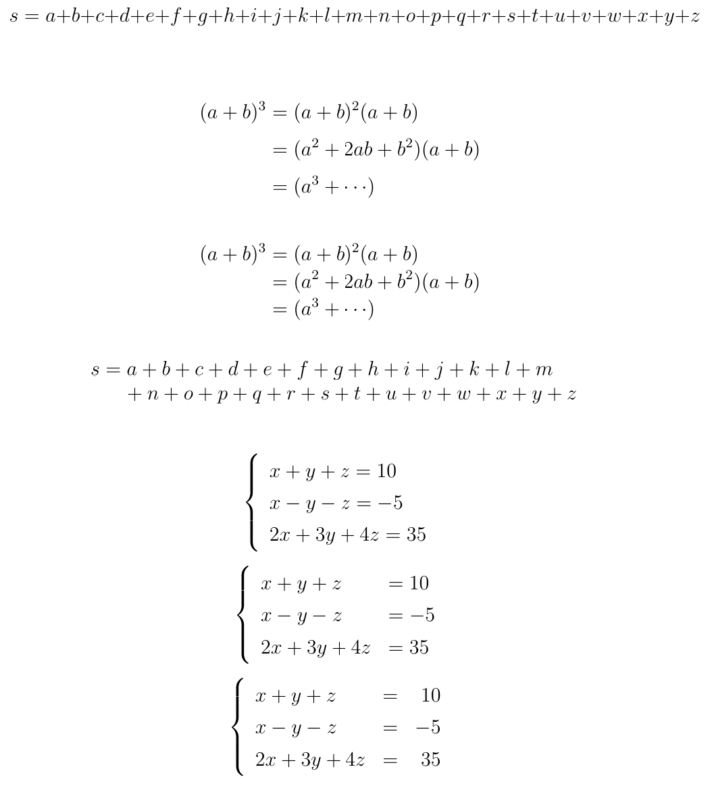{ width="475" }

```tex
\documentclass[12pt]{ctexart}
\usepackage{amsmath} 
\usepackage{mathtools}
\usepackage{breqn} % 自动换行

\begin{document}

多行公式

% 不能换行
\[
s = a+b+c+d+e+f \\
+g+h+i+j+k+l+m+n+o+p+q+r+s+t+u+v+w+x+y+z
\]

% 手动折行
\[
\begin{split}
	(a+b)^3 &= (a+b)^{2}(a+b) \\
	        &= (a^2 + 2ab + b^2)(a + b) \\
	        &= (a^3 + \cdots)
\end{split}
\]

% 自动换行（按等号对齐），加*去除编号
\begin{dmath*}
	(a+b)^3 = (a+b)^{2}(a+b) = (a^2 + 2ab + b^2)
	(a + b) = (a^3 + \cdots)
\end{dmath*}

\begin{dmath*}
	s = a+b+c+d+e+f
	+g+h+i+j+k+l+m+n+o+p+q+r+s+t+u+v+w+x+y+z
\end{dmath*}

\[
\left \{
\begin{array}{l}
	x + y + z = 10 \\
	x - y - z = -5 \\
	2x + 3y + 4z = 35
\end{array}
\right .
\]

\[
\left \{
\begin{array}{ll}
	x + y + z & = 10 \\
	x - y - z & = -5 \\
	2x + 3y + 4z & = 35
\end{array}
\right .
\]

\[
\left \{
\begin{array}{lcr}
	x + y + z & = & 10 \\
	x - y - z & = & -5 \\
	2x + 3y + 4z & = & 35
\end{array}
\right .
\]

\end{document}
```

## 47. 公式 - 分支公式


```tex
\documentclass[12pt]{ctexart}
\usepackage{amsmath} 
\usepackage{mathtools}
\usepackage{amssymb} % 数学符号宏包，这里提供

\begin{document}

分支公式
\kaishu

\[
f(x) =
\begin{cases}
	1, & x \text{为有理数} \\
	0, & x \text{为无理数}
\end{cases}
\]

\[
f(x) =
\begin{cases}
	\dfrac{1}{2} x^2, & x \leq 0 \\
	\dfrac{1}{3} \ln x, & 0 < x < 10 \\
	\dfrac{1}{10} \sqrt{x}, & x \geq 10
\end{cases}
\quad
f(x) =
\begin{dcases}
	\dfrac{1}{2} x^2, & x \leq 0 \\
	\dfrac{1}{3} \ln x, & 0 < x < 10 \\
	\dfrac{1}{10} \sqrt{x}, & x \geq 10
\end{dcases}
\quad
f(x) =
\begin{dcases}
	\dfrac{1}{2} x^2, & x \leqslant 0 \\
	\dfrac{1}{3} \ln x, & 0 < x < 10 \\
	\dfrac{1}{10} \sqrt{x}, & x \geqslant 10
\end{dcases}
\]

\[
\begin{drcases}
	S \subset T \\
	S \supset T
\end{drcases}
\quad
\Rightarrow
\quad
S = T
\]

\end{document}
```

## 48. 公式 - 定理环境与 cleveref 引用

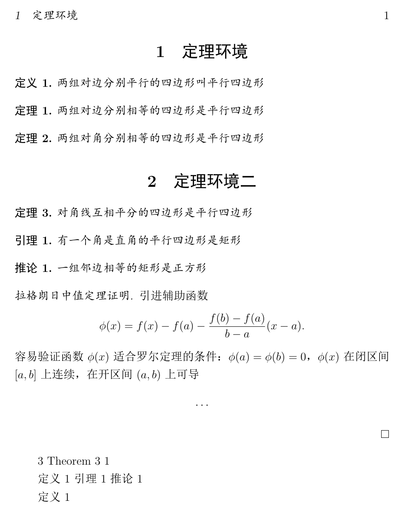{ width="475" }

```tex
\documentclass[12pt]{ctexart}

\usepackage{amsmath}
\usepackage{mathtools}
\usepackage{amsthm} % 包含proof环境

\usepackage[hidelinks]{hyperref}
% \renewcommand{\equationautorefname}{式}
% \renewcommand{\footnoteautorefname}{脚注}
% \renewcommand{\itemautorefname}{项}
% \renewcommand{\figureautorefname}{图}
% \renewcommand{\tableautorefname}{表}
% \renewcommand{\partautorefname}{篇}
% \renewcommand{\appendixautorefname}{附录}
% \renewcommand{\chapterautorefname}{章}
% \renewcommand{\sectionautorefname}{节}
% \renewcommand{\subsectionautorefname}{小小节}
% \renewcommand{\subsubsectionautorefname}{subsubsection}
% \renewcommand{\paragraphautorefname}{段落}
% \renewcommand{\subparagraphautorefname}{子段落}
% \renewcommand{\FancyVerbLineautorefname}{行}
% \renewcommand{\theoremautorefname}{定理}

\usepackage{cleveref}
\crefname{table}{tab.}{tabs.} % 英文环境（区分单复数）
\crefname{definition}{定义}{定义}
\crefname{theorem}{定理}{定理}
\crefname{lemma}{引理}{引理}
\crefname{corollary}{推论}{推论}

% \newtheorem{环境名}[计数器]{显示名}[编号层次]
\newtheorem{definition}{定义}
\newtheorem{theorem}{定理}
\newtheorem{lemma}{引理}
\newtheorem{corollary}{推论}

% 计数器（默认为环境名）
% \newtheorem{definition}{定义}
% \newtheorem{theorem}{定理}
% \newtheorem{lemma}[theorem]{引理}
% \newtheorem{corollary}[theorem]{推论} 

% 编号层次（chapter section）
% section
% \newtheorem{theorem}{定理}[section]
% chapter，换下环境：\documentclass[12pt]{ctexbook}，\chapter{定理环境}
% \newtheorem{theorem}{定理}[chapter] 

\begin{document}

\section{定理环境}

\begin{definition} \label{def:1}
	两组对边分别平行的四边形叫平行四边形
\end{definition}

\begin{theorem} \label{th:1}
	两组对边分别相等的四边形是平行四边形
\end{theorem}

\begin{theorem} \label{th:2}
	两组对角分别相等的四边形是平行四边形
\end{theorem}

\section{定理环境二}

\begin{theorem} \label{th:3}
	对角线互相平分的四边形是平行四边形
\end{theorem}

\begin{lemma} \label{th:4}
	有一个角是直角的平行四边形是矩形
\end{lemma}

\begin{corollary} \label{th:5}
	一组邻边相等的矩形是正方形
\end{corollary}

\newpage

\begin{proof}[拉格朗日中值定理证明]
	引进辅助函数
	\[
	\phi(x) = f(x) - f(a) - \dfrac{f(b) - f(a)}{b-a}
	(x-a).
	\]
	容易验证函数$\phi(x)$适合罗尔定理的条件：
	$\phi(a) = \phi(b) = 0$，
	$\phi(x)$在闭区间$[a,b]$上连续，
	在开区间$(a,b)$上可导
	\[
	\cdots
	\]
\end{proof}

% 定理的引用
\ref{th:3}
\autoref{th:3}
\autoref{th:5} % 只有编号没有标题（autoref的局限）

\cref{def:1}
\cref{th:4}
\cref{th:5}

% 让cref实现类似autoref的跳转功能
% \hyperref[跳转目标]{显示文字}
\hyperref[def:1]{\cref{def:1}}

\end{document}
```

## 49. 章节标题与目录

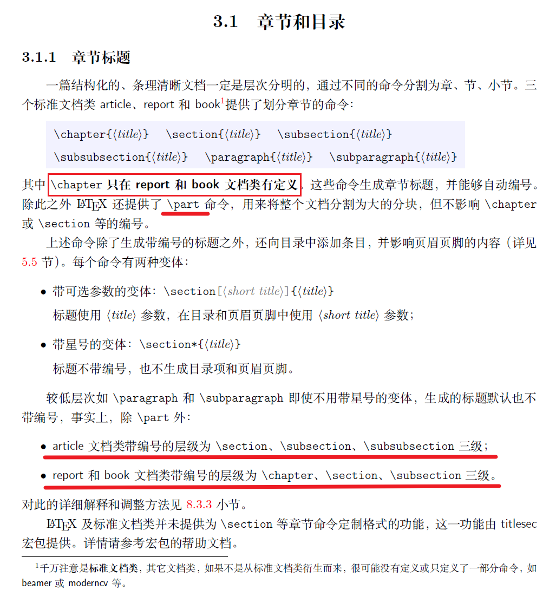{ width="525" }

```tex
\documentclass{ctexbook}
\usepackage{graphicx}
\usepackage{tabularray}

\begin{document}

\tableofcontents % 生成目录
\listoftables % 生成表格目录
\listoffigures % 生成插图目录

\part{\LaTeX 基础部分}

\chapter{\LaTeX 的基本概念}
\section{概述}

\section{第一次使用\LaTeX}

\chapter{用\LaTeX 排版文字}
\section{语言和文字编码}

\section{排版中文}

\part{\LaTeX 进阶}

\chapter{文档元素}
\section{章节和目录}

\section{标题页}
\subsection{目录}
\subsection{文档结构的划分}

\end{document}
```

## 50. 文档结构 - 前言正文附录后记

{ width="525" }

```tex
\documentclass{ctexbook}
\usepackage{graphicx}
\usepackage{tabularray}

\begin{document}

\frontmatter
\chapter{中文版致谢}
\chapter{英文版致谢}
\chapter{前言}

% \addcontentsline{toc}{⟨level⟩}{⟨title⟩}
\tableofcontents \addcontentsline{toc}{chapter}{目录}
\listoftables \addcontentsline{toc}{chapter}{表格列表}
\listoffigures \addcontentsline{toc}{chapter}{图片列表}

\mainmatter

\part{\LaTeX 基础部分}

\chapter{\LaTeX 的基本概念}
\section{概述}

\section{第一次使用\LaTeX}

\chapter{用\LaTeX 排版文字}
\section{语言和文字编码}

\section{排版中文}

\part{\LaTeX 进阶}

\chapter{文档元素}
\section{章节和目录}

\section{标题页}
\subsection{目录}
\subsection{文档结构的划分}

\appendix
\chapter{安装发行版}
\section{发行版简介}
\subsection{安装发行版}
\chapter{排队错误、寻求帮助}
\section{查找帮助文档}

\backmatter
\chapter{参考文献}
\chapter{GNU Free …}
\chapter{索引}
\end{document}
```

## 51. 文档拆分

常用的拆分方式：按 chapter

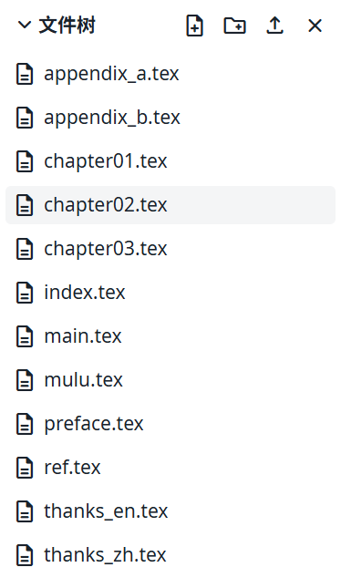{ width="224" }

各文件内容（按顺序）：

```tex
% main.tex
\documentclass{ctexbook}

\input{setup}

\begin{document}

\frontmatter
\include{thanks_zh} % include重新开一页，input直接引入
\include{thanks_en}
\include{preface}

\include{mulu}

\mainmatter
\include{chapter01}
\include{chapter02}
\include{chapter03}

\appendix
\include{appendix_a}
\include{appendix_b}

\backmatter
\include{ref}
\include{index}

\end{document}

% setup
\usepackage{graphicx}
\usepackage{tabularray}

% thanks_zh
\chapter{中文版致谢}
这里是中文致谢

% thanks_en
\chapter{英文版致谢}
This is English

% preface
\chapter{前言}
这里是前言部分

% mulu
\tableofcontents \addcontentsline{toc}{chapter}{目录}
\listoftables \addcontentsline{toc}{chapter}{表格列表}
\listoffigures \addcontentsline{toc}{chapter}{图片列表}

% chapter01
\part{\LaTeX 基础部分}

\chapter{\LaTeX 的基本概念}
\section{概述}

\section{第一次使用\LaTeX}

% chapter02
\chapter{用\LaTeX 排版文字}
\section{语言和文字编码}

\section{排版中文}

% chapter03
\part{\LaTeX 进阶}

\chapter{文档元素}
\section{章节和目录}

\section{标题页}
\subsection{目录}
\subsection{文档结构的划分}

% appendix_a
\chapter{安装发行版}
\section{发行版简介}
\subsection{安装发行版}

% appendix_b
\chapter{排队错误、寻求帮助}
\section{查找帮助文档}

% ref
\chapter{参考文献}

% index
\chapter{索引}
```

## 52. 页眉页脚

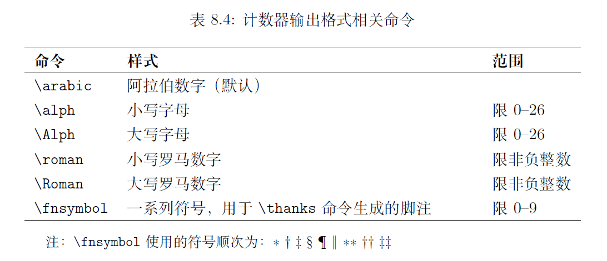{ width="500" }

{ width="500" }

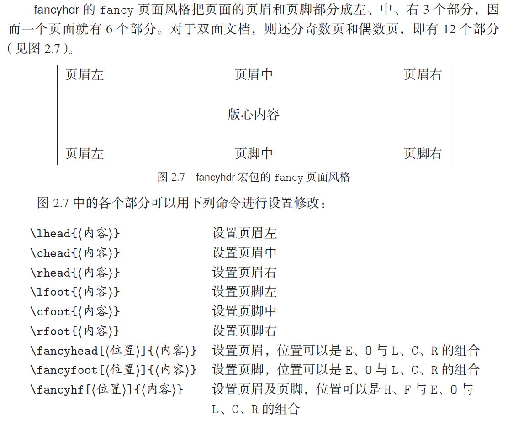{ width="475" }

```tex
% 双面排版，偶数页（左）上面是页数和章标题，奇数页（右）上面是节标题和页数
\documentclass{ctexbook} 
% 单面排版，上面是章标题和页数
% \documentclass[oneside]{ctexbook} 
\usepackage{graphicx}
\usepackage{tabularray}

\usepackage{fancyhdr}  % 自定义页眉页脚
\pagestyle{fancy}      % 使用 fancy 风格，默认放一条横线
\fancyhf{}             % 清除所有页眉页脚
% \chead{\kaishu 北京大学毕业论文（设计）}
% \lhead{\thepage}
% \rhead{\rightmark} % leftmark为章标题，rightmark为节标题（双面排版样式）
% \cfoot{\thepage}
% \renewcommand{\headrulewidth}{0pt} % 去除页眉横线
% \renewcommand{\footrulewidth}{1pt} % 设置页脚横线
% \fancyhead[EC]{\thepage}
% \fancyhead[OC]{\kaishu 北京大学毕业论文（设计）}
\fancyhf[FR]{\thepage}

% \pagestyle{empty} 
% \pagestyle{plain} 
% \pagestyle{headings} 

\begin{document}

\frontmatter
\chapter{中文版致谢}
\chapter{英文版致谢}
\chapter{前言}

\tableofcontents \addcontentsline{toc}{chapter}{目录}
\listoftables \addcontentsline{toc}{chapter}{表格列表}
\listoffigures \addcontentsline{toc}{chapter}{图片列表}

\mainmatter

\part{\LaTeX 基础部分}

\chapter{\LaTeX 的基本概念}
\section{概述}

\section{第一次使用\LaTeX}

\chapter{用\LaTeX 排版文字}
\section{语言和文字编码}

\section{排版中文}

% \pagenumbering{arabic} % 使用阿拉伯数字页码（1, 2, 3, …），并将页码计数重置为 1
% \pagenumbering{Roman} % 使用大写罗马数字页码（I, II, III, …），并将页码计数重置为 1

\part{\LaTeX 进阶}

\chapter{文档元素}
\section{章节和目录}

\section{标题页}
\subsection{目录}
\subsection{文档结构的划分}

\appendix
\chapter{安装发行版}
\section{发行版简介}
\subsection{安装发行版}
\chapter{排队错误、寻求帮助}
\section{查找帮助文档}

\backmatter
\chapter{参考文献}
\chapter{GNU Free …}
\chapter{索引}
\end{document}
```

## 53. 参考文献

### 53.1 bibtex

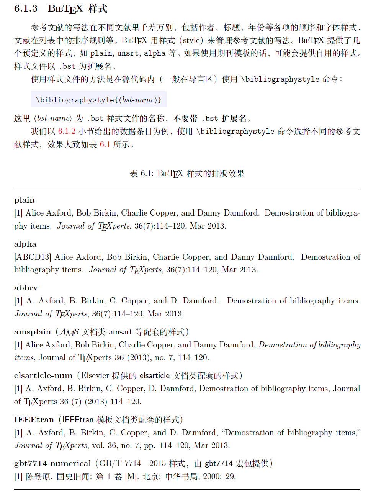{ width="500" }

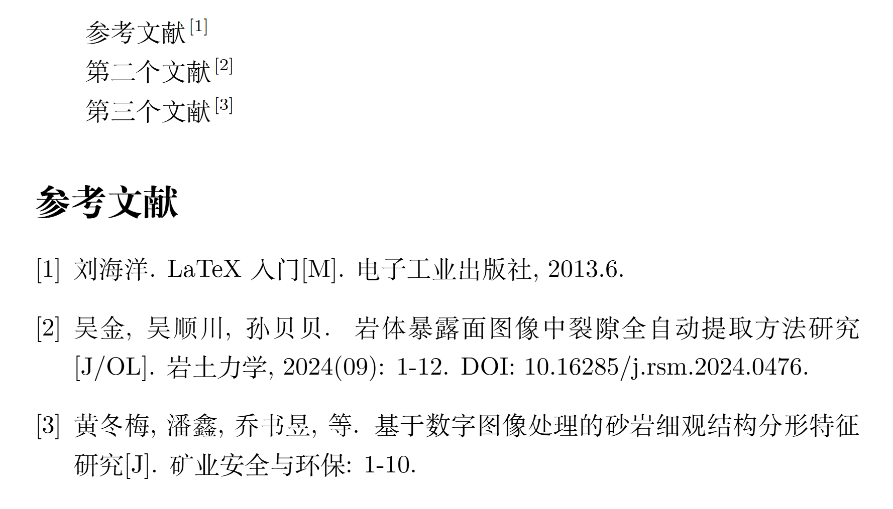{ width="500" }

```tex
% main.tex
\documentclass{article}
\usepackage{ctex}
\usepackage{gbt7714}

\bibliographystyle{gbt7714-numerical}

\begin{document}
% 文献管理工具 JabRef Zotero
参考文献\cite{bk1}

第二个文献\cite{wx1}

第三个文献\cite{wx2}

\bibliography{ckwx}
\end{document}

% ckwx.bib
@book{bk1,
  author    = {刘海洋},
  title     = {LaTeX 入门},
  publisher = {电子工业出版社},
  year      = {2013.6}
}
@article{wx1,
  author  = {吴金 and 吴顺川 and 孙贝贝},
  title   = {岩体暴露面图像中裂隙全自动提取方法研究},
  journal = {岩土力学},
  number  = {09},
  pages   = {1--12},
  year    = {2024},
  issn    = {1000-7598},
  doi     = {10.16285/j.rsm.2024.0476}
}
@article{wx2,
  author  = {黄冬梅 and 潘鑫 and 乔书昱 and 朱盈盈 and 王新照},
  title   = {基于数字图像处理的砂岩细观结构分形特征研究},
  journal = {矿业安全与环保},
  pages   = {1--10},
  issn    = {1008-4495}
}
```

一般在线环境会自动完成编译流程，手动编译流程（了解）：

```powershell
# 可省略后缀名
xelatex main.tex
bibtex main.aux
xelatex main.tex
xelatex main.tex
```

除了命令行也可以鼠标点击，例如 Texstudio 中，找到工具 (T) →命令 (C)

### 53.2 biblatex

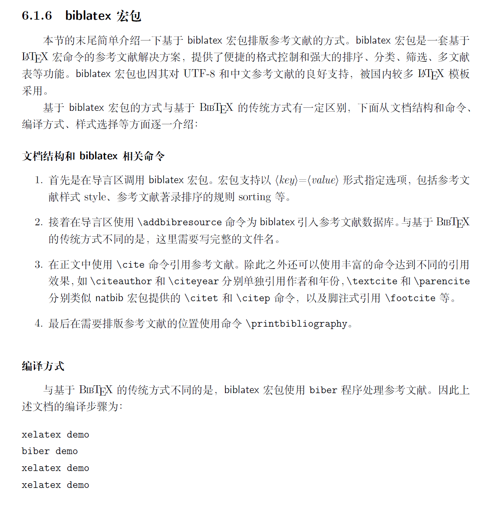{ width="500" }

{ width="500" }

```tex
\documentclass{article}
\usepackage{ctex}
% \usepackage{gbt7714}

% \bibliographystyle{gbt7714-numerical}
\usepackage[style=gb7714-2015]{biblatex}
\addbibresource{ckwx.bib}

\begin{document}
% 文献管理工具 JabRef Zotero
参考文献\citeauthor{bk1}

第二个文献\citeyear{wx1}

第三个文献\textcite{wx2}

第三个文献\parencite{wx2}

第三个文献\footcite{wx2}

% \bibliography{ckwx}
\printbibliography
\end{document}
```

## 54. 索引

{ width="500" }

```tex
\documentclass{article}
\usepackage{ctex}
\usepackage{imakeidx} % 生成索引

\makeindex[title={名词索引}] % 开启索引收集
\makeindex[name={person}, title={人物索引}] % 索引分类
\makeindex[name={org}, title={机构索引}]

\renewcommand{\seename}{参见}
\renewcommand{\alsoname}{又见}

\begin{document}

索引

勾股定理\index{勾股定理} % 关键词\index{关键词}

\index[org]{北京大学|(}

\index{地名!北京} % 用英文感叹号!分级
\index[person]{人名!王也}
\index{地名!浙江!杭州}
\index[person]{人名!冯宝宝}
\index{gougu@$a^2+b^2=c^2$} % 用@格式化索引

\index{毕达哥拉斯定理|see{勾股定理}} % 格式化索引页码
\index{商高定理|seealso{勾股定理}}

\newpage
整点内容
\index{北京大学|)}

\printindex % 输出索引

\printindex[person]

\printindex[org]

\end{document}
```

## 55. TikZ - 绘图直线坐标

{ width="300" }

```tex
\documentclass[b5paper]{article}
\usepackage{ctex}
\usepackage{tikz}

\begin{document}
\section{直线绘制与坐标表示}
% 直线绘制：\draw (<起点>) -- (<终点>);
% 坐标表示：
%   直角坐标：(x, y)
%   极坐标：(a:r) <极角>:<极径> 极角使用角度
%   默认单位为cm，可改为其他单位，
% 坐标点定义：\coordinate (<名称>) at (<点坐标>);
\begin{tikzpicture}
  \draw (0,-1) -- (0,3);
  \draw (-1,0) -- (3,0);
  \draw (0,0) -- (30:2);
  \draw (30:2) -- (60:2);

  \coordinate (A) at (2, 1);
  \coordinate (B) at (5, 1);
  
  \draw (A) -- (B);
  \draw (1, 1) -- +(2, 3);
\end{tikzpicture}

\end{document}
```

## 56. TikZ - 基本图形绘制

Latex 素材网站：[Texample](https://texample.net/)

{ width="300" }

```tex
\documentclass[b5paper]{article}
\usepackage{ctex}
\usepackage{tikz}

\begin{document}
\section{基本图形绘制}
% 箭头： -> <- <-> |<->| >->
%     风格： stealth latex to
\begin{figure}[htbp]
    \centering
    \begin{tikzpicture}[>=latex] % 全局风格，不单独设置就用这个
        \draw[->] (0, 0) -- (5, 0);
        \draw[|<-] (0, 1) -- (5, 1);
        \draw[|<->|] (0, 1.2) -- (5, 1.2);
        \draw[<-<] (0, 1.4) -- (5, 1.4);
        \draw[stealth-] (0, 1.6) -- (5, 1.6);
        \draw[-latex] (0, 1.8) -- (5, 1.8);
    \end{tikzpicture}
    \caption{箭头}
    \label{fig:enter-label}
\end{figure}

% 直角： -| |-
\begin{tikzpicture}
    % \draw (0, 1) -| (1, 0);
    \draw (0, 1) |- (1, 0);
\end{tikzpicture}

% 矩形： \draw (<起点>) rectangle (<对角点>)
%        \draw (<起点>) rectangle +(<坐标差值(宽/高)>)
\begin{tikzpicture}
    \draw (0, 0) rectangle (3, 2);
    \draw (4, 0) rectangle +(1, 2);
\end{tikzpicture}

% 网格： \draw[step=1] (<起点>) grid (<网格区域对角坐标>)
\begin{tikzpicture}
    \draw[step=0.5] (-1, 0) grid +(4, 4);
\end{tikzpicture}

% 圆：   \draw (<圆心>) circle (<半径>)
%        \draw (<圆心>) circle [radius=<R>]
% 椭圆： \draw (<圆心>) ellipse [x radius=a, y radius = b]
\begin{tikzpicture}
    \draw (0, 0) circle (2);
    \draw (0, 0) circle [radius = 1];
    \draw (0, 0) ellipse [x radius = 2, y radius = 1];
    \draw (-2, 0) -- (2, 0);
    \draw (0, -2) -- (0, 2);
\end{tikzpicture}

% 圆弧： \draw (<起点>) arc (<初始角>:<终止角>:<半径>)
%        \draw(<起点>) arc [start angle=<初始角>, end angle=<终止角>, radius=<半径>]
\begin{tikzpicture}
    \draw (0, 0) arc (45:180:2);
    \draw (1, 1) arc [start angle=30, end angle = 120, radius = 1];
\end{tikzpicture}

% 椭圆弧：\draw (<起点>) arc (<初始角>:<终止角>:<x轴径> and <y轴径>)
\begin{tikzpicture}
    \draw (0, 0) arc (0:80:2 and 1);
    \draw (0, 4) arc [start angle=0, end angle=135, x radius=2, y radius=1];
\end{tikzpicture}

\end{document}
```

## 57. TikZ - 线条样式

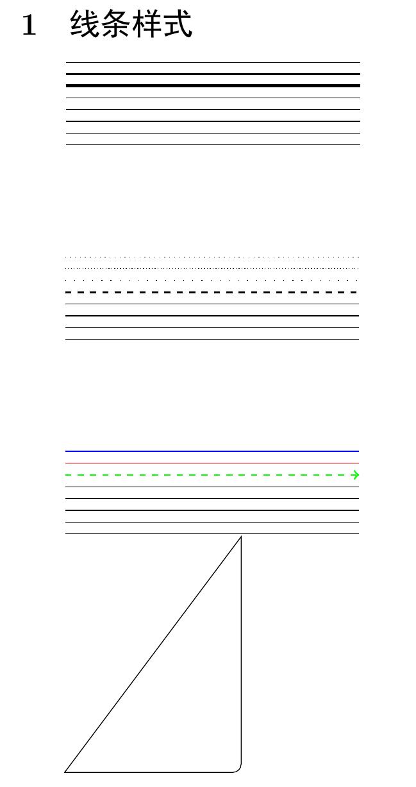{ width="300" }

```tex
\documentclass[b5paper]{article}
\usepackage{ctex}
\usepackage{tikz}

\begin{document}
\section{线条样式}
% 粗细预设值：
% ultra thin   0.1pt
% very thin    0.2pt
% thin         0.4pt
% semithick    0.6pt
% thick        0.8pt
% very thick   1.2pt
% ultra thick  1.6pt
% 也可使用 line width = <数值>
% \begin{tikzpicture}[line width=2pt] % 全局设置
\begin{tikzpicture}
    \draw[very thin] (0, 1.4) -- (5, 1.4);
    \draw[thick] (0, 1.2) -- (5, 1.2);
    \draw[ultra thick] (0, 1) -- (5, 1);
    \draw (0, 0.8) -- (5, 0.8);
    \draw (0, 0.6) -- (5, 0.6);
    \draw (0, 0.4) -- (5, 0.4);
    \draw (0, 0.2) -- (5, 0.2);
    \draw (0, 0) -- (5, 0);
\end{tikzpicture}

% 样式
%   help lines
%
%           solid
%   densely  dashed
%           dotted
%   loosely  dash dot
%           dash dot dot
\vspace{5em}
% \begin{tikzpicture}[dash dot dot, thick]
\begin{tikzpicture}
    \draw[dotted] (0, 1.4) -- (5, 1.4);
    \draw[densely dotted] (0, 1.2) -- (5, 1.2);
    \draw[loosely dotted] (0, 1) -- (5, 1);
    \draw[dashed, thick] (0, 0.8) -- (5, 0.8);
    \draw (0, 0.6) -- (5, 0.6);
    \draw (0, 0.4) -- (5, 0.4);
    \draw (0, 0.2) -- (5, 0.2);
    \draw (0, 0) -- (5, 0);
\end{tikzpicture}

% 颜色
\vspace{5em}
% \definecolor[blue!20] % 颜色深度只有20%
% \definecolor{org}{rgb}{1, 0.5, 0} % 自定义颜色
% \begin{tikzpicture}[org]
\begin{tikzpicture}
    \draw[blue] (0, 1.4) -- (5, 1.4);
    \draw[red] (0, 1.2) -- (5, 1.2);
    \draw[green, dashed, thick, ->] (0, 1) -- (5, 1);
    \draw (0, 0.8) -- (5, 0.8);
    \draw (0, 0.6) -- (5, 0.6);
    \draw (0, 0.4) -- (5, 0.4);
    \draw (0, 0.2) -- (5, 0.2);
    \draw (0, 0) -- (5, 0);
\end{tikzpicture}

% 圆角与直角
%   rounded corners [=r] / sharp corners
\begin{tikzpicture}
    % \draw[rounded corners=10pt, thick, blue, dashed]
    (0, 0 ) rectangle (3, 4);
    % 需要调整，不一定那个点就是设置的
    \draw (0, 0)[rounded corners] -- (3, 0)[sharp corners] -- (3, 4) -- cycle;
\end{tikzpicture}

\end{document}
```

## 58. TikZ - scope 环境、样式复用

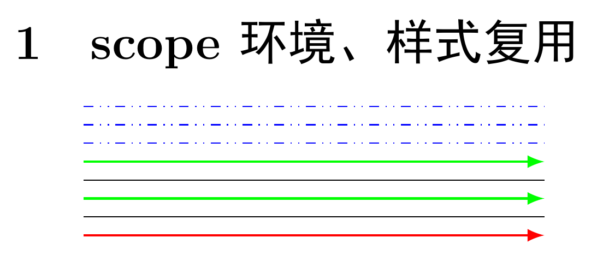{ width="300" }

```tex
\documentclass[b5paper]{article}
\usepackage{ctex}
\usepackage{tikz}

\begin{document}
\section{scope环境、样式复用}
% [<名称>]/.style={<样式>}
\begin{tikzpicture}
    [garrow/.style={green, thick, -latex}] % 样式定义需要放在环境开头
    
    \begin{scope}[blue, dash dot dot]
        \draw (0, 1.4) -- (5, 1.4);
        \draw (0, 1.2) -- (5, 1.2);
        \draw (0, 1) -- (5, 1);
    \end{scope}

    \draw[garrow] (0, 0.8) -- (5, 0.8);
    \draw (0, 0.6) -- (5, 0.6);
    \draw[garrow] (0, 0.4) -- (5, 0.4);
    \draw (0, 0.2) -- (5, 0.2);
    \draw[garrow, red] (0, 0) -- (5, 0);
\end{tikzpicture}

\end{document}
```

## 59. TikZ - 形变

{ width="350" }

```tex
\documentclass[b5paper]{article}
\usepackage{ctex}
\usepackage{tikz}

\begin{document}
\section{形变}
% 位移 xshift yshift xslant yslant
% 缩放 scale
% 旋转 rotate
% \begin{tikzpicture}[xshift...] % 全局设置
\begin{tikzpicture}
    \draw[dashed] (0, 0) rectangle (1, 1);
    \draw[blue, xshift=-1.2cm, yshift=1cm] (0, 0) rectangle (1, 1);
    \draw[blue, xslant=1.5] (0, 0) rectangle (1, 1);
    \draw[blue, yslant=1.5] (0, 0) rectangle (1, 1);
    \draw[blue, scale=0.5] (0, 0) rectangle (1, 1);
    \draw[blue, scale=1.5] (0, 0) rectangle (1, 1);
    \draw[blue, rotate=30] (0, 0) rectangle (1, 1);
    \draw[blue, rotate=-30, scale=2, xshift=2cm] (0, 0) rectangle (1, 1); % 按顺序
    \draw[blue, xshift=2cm, rotate=-30, scale=2] (0, 0) rectangle (1, 1);
\end{tikzpicture}

\end{document}
```

## 60. TikZ - 绘制与填充

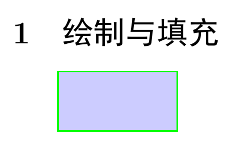{ width="250" }

```tex
\documentclass[b5paper]{article}
\usepackage{ctex}
\usepackage{tikz}

\begin{document}
\section{绘制与填充}
\begin{tikzpicture}[thick]
    \draw[green, fill=blue!20] (0, 0) rectangle (2, 1); % 掌握这种，边框+填充
    % \draw[blue!20, fill=blue!20] (0, 0) rectangle (2, 1);
    % \fill[green, draw=blue] (0, 0) rectangle (2, 1);
    % \filldraw[fill=green, draw=blue] (0, 0)
    rectangle (2, 1);
\end{tikzpicture}

\end{document}
```

## 61. TikZ - 文字结点

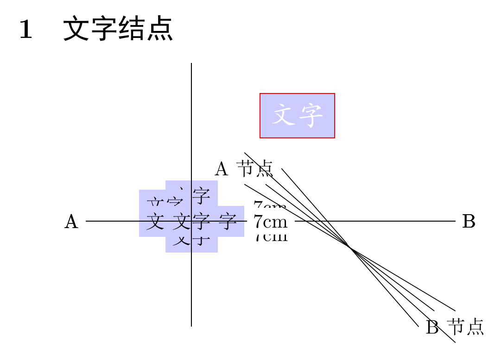{ width="350" }

```tex
\documentclass[b5paper]{article}
\usepackage{ctex}
\usepackage{tikz}

\begin{document}
\section{文字结点}
% \node[<选项>] (<名称>) at (<坐标>) {<文本内容>};
% <对象> node [<选项>] {<文本内容>};
% 选项：
%   fill=<背景颜色>
%   draw=<边框颜色>
%   text=<文字颜色>
%   node font = {<字体>}
%   位置：
%       above=2pt
%       below
%       left
%       right
%       centered
%       above left
%       above right
%       below left
%       below right
% 为所有结点设置相同样式：
%   [every node/.style={<样式>}]
% \begin{tikzpicture}[every node/.style={<样式>}]
% \begin{tikzpicture}[every node/.style={fill=blue!20}]
\begin{tikzpicture}
	% 前面的先画，后面的可能会覆盖前面的
	\node[] at (2, 2) {A};
	\node[fill=blue!20, circle] at (2, 2) {A};
	\node[fill=blue!20, draw=red, node font={\kaishu\Large}, 
			text=white] at (2, 2) {文字};
	\node[fill=blue!20] at (0, 0) {文字};
	\node[fill=blue!20, above] at (0, 0) {文字};
	\node[fill=blue!20, above=5pt] at (0, 0) {文字};
	\node[fill=blue!20, above left] at (0, 0) {文字};
	\node[fill=blue!20, below] at (0, 0) {文字};
	\node[fill=blue!20, left] at (0, 0) {文字};
	\node[fill=blue!20, right] at (0, 0) {文字};
	\node[fill=blue!20, centered] at (0, 0) {文字}; % 默认
	
	\draw (-2, 0)node[left] {A} -- (5, 0)node[right] {B};
	\draw (-2, 0)node[left] {A} --node[above]{7cm} (5, 0)node[right] {B};
	\draw (-2, 0)node[left] {A} --node[below]{7cm} (5, 0)node[right] {B};
	\draw (-2, 0)node[left] {A} --node[fill=white]{7cm} (5, 0)node[right] {B};	
	
    \draw (0, -2) -- (0, 3);
    
    \node (A) at (1, 1) {A节点}; 
    \node (B) at (5, -2) {B节点}; 
    \draw (A) -- (B); % 用一种比较近的方式连接
    \draw (A.east) -- (B.west);
    \draw (A.north) -- (B.south);
    \draw (A.south) -- (B.north);
\end{tikzpicture}

\end{document}
```

## 62. TikZ - 循环绘制与坐标轴

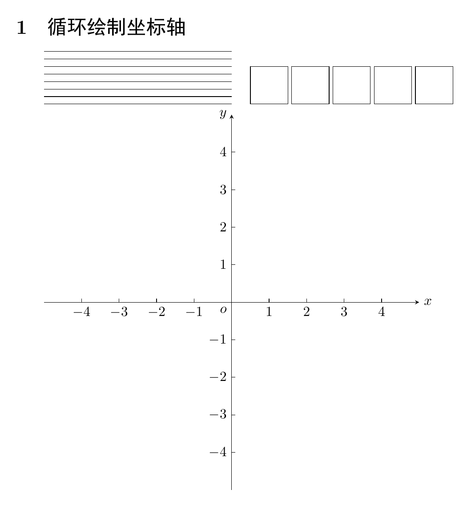{ width="350" }

```tex
\documentclass[b5paper]{article}
\usepackage{ctex}
\usepackage{tikz}

\begin{document}
% \foreach \<变量名> in {<列表>} {<绘图命令>}
\section{循环 绘制坐标轴}
\begin{tikzpicture}
    % \draw (0, 1.4) -- (5, 1.4);
    % \draw (0, 1.2) -- (5, 1.2);
    % \draw (0, 1) -- (5, 1);
    % \draw (0, .8) -- (5, .8);
    % \draw (0, .6) -- (5, .6);
    % \draw (0, .4) -- (5, .4);
    % \draw (0, .2) -- (5, .2);
    % \draw (0, 0) -- (5, 0);
    % \foreach \y in {1.4, 1.2, 1, .8, .6, .4, .2, 0} {
    % \draw (0, \y) -- (5, \y);
    % }
 	\foreach \y in {1.4, 1.2, ..., 0} {
    \draw (0, \y) -- (5, \y);
    }   

    % \draw (5.5, 0) rectangle +(1, 1);
    % \draw (6.6, 0) rectangle +(1, 1);
    % \draw (7.7, 0) rectangle +(1, 1);
    % \draw (8.8, 0) rectangle +(1, 1);
    % \draw (9.9, 0) rectangle +(1, 1);
    \foreach \x in {5.5, 6.6, 7.7, 8.8, 9.9} {  % 用...可能有误差导致画不全
    \draw (\x, 0) rectangle +(1, 1);
	} 
\end{tikzpicture}

\begin{tikzpicture}
    % 绘制带箭头的 x 轴和 y 轴
    \draw[-stealth] (-5, 0) -- (5, 0)node[right] {$x$};
    \draw[-stealth] (0, -5) -- (0, 5)node[left] {$y$};
    % 绘制原点标签
    \node[below left] at (0, 0) {$o$};
    % 循环绘制刻度线和数值标签
    % 跳过0，避免画重
    \foreach \x in {-4, -3, ..., -1, 1, 2, ..., 4} {
        \draw (\x, 0)node[below]{$\x$} -- (\x, 0.1); % x 轴刻度
        \draw (0, \x)node[left]{$\x$} -- (0.1, \x);  % y 轴刻度
    }
\end{tikzpicture}

\end{document}
```

## 63. TikZ - 绘制函数图象

{ width="350" }

```tex
\documentclass[b5paper]{article}
\usepackage{ctex}
\usepackage{tikz}

\begin{document}
\section{绘制函数图像}
% y = 0.5 * x * x
% y = x
% y = 0.25 * 2^x
% y = x ^ 0.5
% 定义域：domain=x1:x2 采样点数：samples=N（默认25）
% \begin{tikzpicture}[thick, domain=0:4.5, samples=100] % 统一设置
\begin{tikzpicture}[thick]
    % 绘制坐标轴
    \draw[-stealth] (-5, 0) -- (5, 0) node[right] {$x$};
    \draw[-stealth] (0, -1) -- (0, 9) node[left] {$y$};
    % 绘制坐标点标注
    \node[below left] at (0, 0) {$O$};
    \node[below] at (-4, 0) {$-4$};
    \node[below] at (4, 0) {$4$};
    \node[left] at (0, 8) {$8$};
    % 绘制网格辅助线
    \draw[dashed, help lines, ultra thin] (-4.5, -1) grid (4.5, 8.5);
    % 绘制函数
    \draw[domain=-1:5] plot (\x, {\x}) node[right] {$y=x$};
	\draw[domain=-4:4, samples=100, red] plot (\x, {0.5 * \x * \x}) 
    node[right] {$\frac{1}{2}x^2$};
	\draw[domain=-4:5, blue] plot(\x, {0.25 * 2 ^ \x}) 
    node[right] {$y=\frac{1}{4}\times 2^x$};
	\draw[domain=0:4, green] plot (\x, {\x ^ 0.5}) 
    node[right] {$y=\sqrt{x}$};
\end{tikzpicture}

\vspace{3em}

% y = sin x
% y = sin x + 1
% y = sin(x + 1)
\begin{tikzpicture}[thick, scale=0.8, domain=-2*pi:2*pi, samples=100]
    % 绘制坐标轴
    \draw[-stealth] (-6.5, 0) -- (6.5, 0) node[right] {$x$};
    \draw[-stealth] (0, -2) -- (0, 2.3) node[left] {$y$};
    % 原点与辅助线网格
    \node[below left] at (0, 0) {$O$};
    \draw[dashed, help lines, ultra thin] (-6.5, -2) grid (6.5, 2); 
    % 轴刻度标注
    \node[below] at (-4, 0) {$-4$};
    \node[below] at (4, 0) {$4$};
    \node[left] at (0, -1) {$-1$};
    \node[left] at (0, 1) {$1$};
    % 绘制正弦曲线及其变换
    \draw plot (\x, {sin(\x r)}); % 转换为弧度制
    \draw[red] plot (\x, {sin(\x r) + 1});
    \draw[blue] plot (\x, {sin(\x r + 1 r)});
\end{tikzpicture}

\end{document}
```

## 64. 初识 beamer 幻灯片

```tex
\documentclass[aspectratio=169]{beamer}
\usepackage{ctex}

\title{\LaTeX 技术交流}
\author{张大彪}
\institute{北京大学}
\date{2024 年 8 月 8 日}

\begin{document}
\maketitle

\begin{frame} {\LaTeX 概论}{\LaTeX 的发展}
    % \frametitle{\LaTeX 概论}
    % \framesubtitle{\LaTeX 的发展}
    \begin{block}{常用命令}
        1324165416565256341655
    \end{block}
\end{frame}

\end{document}
```

## 65. CTeX 补充内容（文档阅读）

```tex
% 两种引入方式（有细微差别）
% 引入文档类（建议）
\documentclass{ctexbook}
% 引入ctex宏包
% \documentclass{book}
% \usapackage{ctex}

% \usapackage[heading=true]{ctex} % 标题恢复到ctexbook样式

% \documentclass[scheme=plain]{ctexbook} % 默认为chinese
% \documentclass[autoindent=0em]{ctexbook} % 缩进，也可以在ctexset里设置

\usepackage{graphicx}
\usepackage{tabularray}
\usepackage{xcolor}

\ctexset{
    autoindent = 0em,
    today = big,
    % abstractname = {本文概要},
    % bibname = {文\quad 献},
    listfigurename = {图片列表},
    figurename = {照片},
    % abstractname = {摘\quad 要}, % book里没有abstract环境，这里不演示
    % chapter/name = {第, 回} % 英文逗号，第三章->第三回
    chapter = {
    	name = {第, 回},
    	number = \arabic{chapter} 
    },
    section = {
    	name = {第, 节},
    	% name = {\S},
    	% number = \chinese{section},
    	% number = \Roman{section},
    	% format = \kaishu, % 会丢掉原来格式
    	% format += \kaishu\Huge, % 保留原来格式
    	format +=\sectiontitleformat,
    	% nameformat +=\sectiontitleformat,
    	% numberformat +=\sectiontitleformat,
    	% titleformat +=\sectiontitleformat
    }
}
    
\newcommand{\sectiontitleformat}[1]{
	\kaishu 
	\color{green} 
	\fbox{#1} 
}    
    
\begin{document}
\today

\frontmatter
\chapter{中文版致谢}
\chapter{英文版致谢}
\chapter{前言}

\tableofcontents 
\listoftables 
\listoffigures

\mainmatter

\part{\LaTeX 基础部分}

\chapter{\LaTeX 的基本概念}
\section{概述}

\section{第一次使用\LaTeX}

\chapter{用\LaTeX 排版文字}
\section{语言和文字编码}

\section{排版中文}

\part{\LaTeX 进阶}

\chapter{文档元素}
\section{章节和目录}

\section{标题页}
\subsection{目录}
\subsection{文档结构的划分}

\appendix
\chapter{安装发行版}
\section{发行版简介}
\subsection{安装发行版}
\chapter{排队错误、寻求帮助}
\section{查找帮助文档}

\backmatter
\chapter{参考文献}
\chapter{GNU Free …}
\chapter{索引}
\end{document}
```


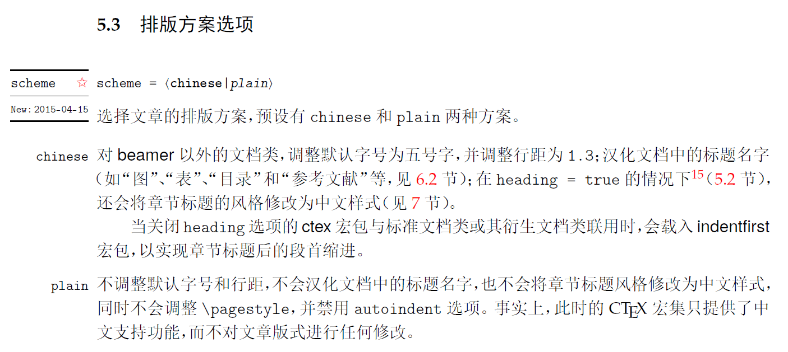
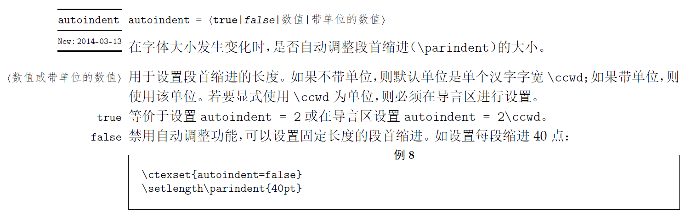

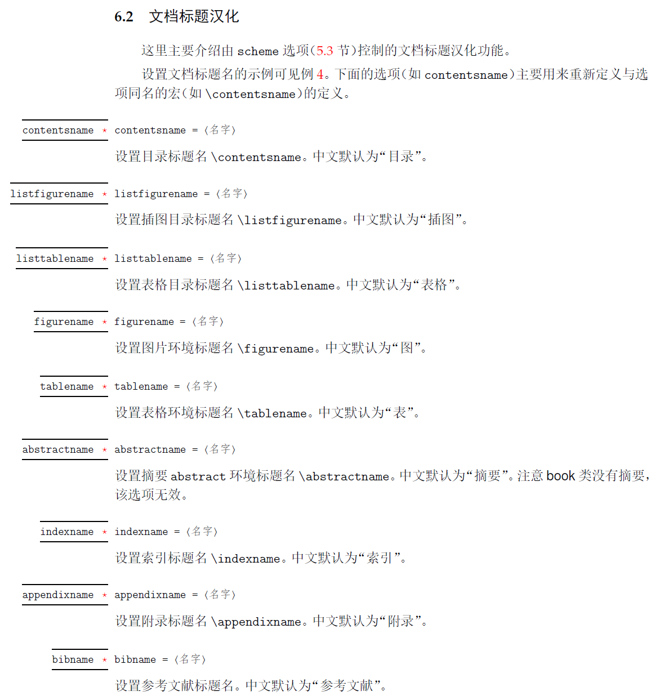

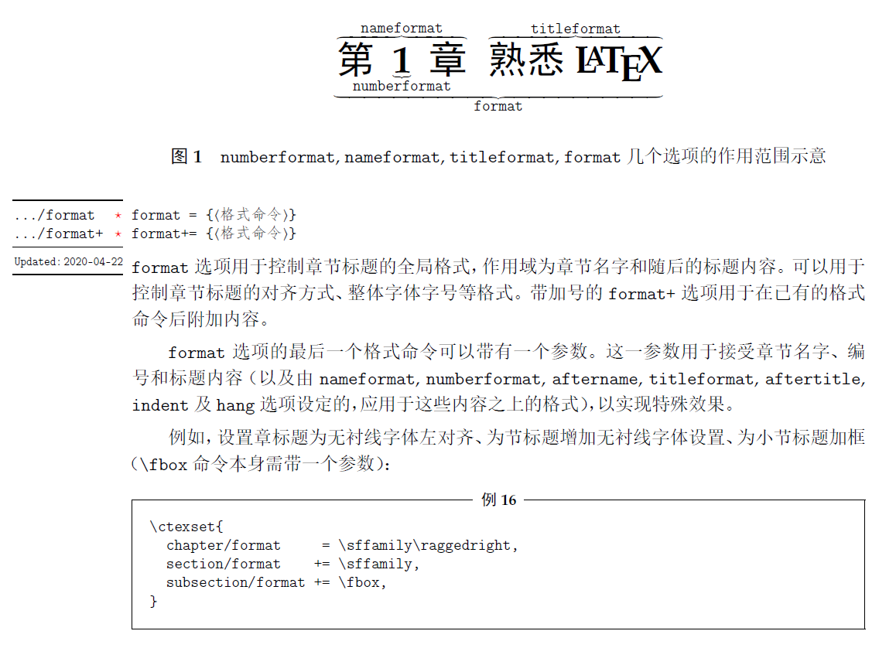
## 66. 一些目录样式

{ width="350" }

```tex
\documentclass{ctexbook}
\usepackage{graphicx}
\usepackage{tabularray}
\usepackage{xcolor}

\usepackage{shorttoc} % 生成简明目录
% 双栏排版，在线环境需要写全toc lot lof，如果只写一个其它目录显示为空白
\usepackage[toc, lot, lof]{multitoc} 
% 本地环境可以只写一个，其它目录正常显示但，但需要编译两次
% \usepackage[toc]{multitoc}
\usepackage[hidelinks]{hyperref} % 使目录能点击跳转并去掉框线
% \usepackage[colorlinks, linkcolor=blue!50]{hyperref} % 设置目录颜色

\begin{document}

\frontmatter
\chapter{中文版致谢}
\chapter{英文版致谢}
\chapter{前言}

\shorttoc{简明目录}{0} % 0 1 2

\tableofcontents 
\listoftables 
\listoffigures 

\mainmatter

\part{\LaTeX 基础部分}

\chapter{\LaTeX 的基本概念}
\section{概述}

\section{第一次使用\LaTeX}

\chapter{用\LaTeX 排版文字}
\section{语言和文字编码}

\section{排版中文}

\part{\LaTeX 进阶}

\chapter{文档元素}
\section{章节和目录}

\section{标题页}
\subsection{目录}
\subsection{文档结构的划分}

\appendix
\chapter{安装发行版}
\section{发行版简介}
\subsection{安装发行版}
\chapter{排队错误、寻求帮助}
\section{查找帮助文档}

\backmatter
\chapter{参考文献}
\chapter{GNU Free …}
\chapter{索引}
\end{document}
```

## 67. 为页面设置背景图片


```tex
\documentclass{ctexbook}
\usepackage{graphicx}
\usepackage{tabularray}
\usepackage{xcolor}

\usepackage{wallpaper}
% 前为导言区设置全局，后为设置单页
% \TileSquareWallPaper{平铺数}{图形名} \ThisTileSquareWallPaper
% \TileWallPaper{图宽}{图高}{图形名} \ThisTileWallPaper
% \CenterWallPaper{缩放系数}{图形名} \ThisCenterWallPaper
% \ULCornerWallPaper{缩放系数}{图形名} \ThisULCornerWallPaper
% \URCornerWallPaper{缩放系数}{图形名} \ThisURCornerWallPaper
% \LLCornerWallPaper{缩放系数}{图形名} \ThisLLCornerWallPaper
% \LRCornerWallPaper{缩放系数}{图形名} \ThisLRCornerWallPaper
% \ClearWallPaper
% 横向平铺
\TileSquareWallPaper{4}{img/test_img_2.jpg}
% 铺满页面
% \TilewallPaper{\paperwidth}{\paperheight}{img/test_img_2.jpg}
% 放在中间
% \CenterwallPaper{1}{img/test_img_2.jpg}
% 放在左上角
% \URCornerwallPaper{0.5}{img/test_img_2.jpg}

\begin{document}

\frontmatter
\chapter{中文版致谢}
\chapter{英文版致谢}
\chapter{前言}


\tableofcontents
\listoftables
\listoffigures

\mainmatter

\part{\LaTeX 基础部分}

\chapter{\LaTeX 的基本概念}
\section{概述}

\section{第一次使用\LaTeX}

\chapter{用\LaTeX 排版文字}
\section{语言和文字编码}

\section{排版中文}

\ClearWallPaper % 之后不会设置背景图片

\part{\LaTeX 进阶}

\chapter{文档元素}
\section{章节和目录}

\section{标题页}
\subsection{目录}
\subsection{文档结构的划分}

\appendix
\chapter{安装发行版}
\section{发行版简介}
\subsection{安装发行版}
\chapter{排队错误、寻求帮助}
\section{查找帮助文档}

\backmatter
\chapter{参考文献}
\chapter{GNU Free …}
\chapter{索引}
\end{document}
```

## 68. cutwin 文字环绕排版

{ width="350" }

```tex
\documentclass{ctexbook}
\usepackage{graphicx}
\usepackage{cutwin} % 文字环绕
\begin{document}

被罢黜的委内瑞拉总统尼古拉斯·马杜罗及其妻子西莉亚·弗洛雷斯周一在首次出庭时,对联邦毒品恐怖主义和毒品走私指控表示不认罪。两天前,他们在加拉加斯被美国军队逮捕。"我是无辜的。我不认罪。我是我国家的正派总统,"92岁的美国地区法官阿尔文·赫勒斯坦在曼哈顿联邦法院正午听证会上询问其抗辩时,马杜罗如此宣称。随后法官打断了他,表示:"将代表马杜罗先生输入不认罪抗辩。"​这对夫妇面临的指控包括毒品恐怖主义阴谋、可卡因进口阴谋以及持有机枪和破坏性装置。如果罪名成立,他们可能面临终身监禁。马杜罗已聘请巴里·波拉克作为辩护律师,这位驻华盛顿特区的律师曾在2024年成功为维基解密创始人朱利安·阿桑奇争取到释放。弗洛雷斯由德克萨斯州律师马克·唐纳利代理。

\vspace{5em} % 减轻和上文的重叠

% \opencutleft  在左边挖孔
% \opencutright 在右边挖孔
% \opencutcenter 在中间挖孔
% \begin{cutout}{〈顶部行数〉}{〈左边文字宽度〉}{〈右边文字宽度〉}{〈高度行数〉}
% 在右边挖孔时〈右边文字宽度〉无效
% 在左边挖孔时〈左边文字宽度〉无效
% 用\renewcommand{\windowpagestuff}{}定义放入空白处的内容
\renewcommand{\windowpagestuff}{ \center % 默认靠左，靠右：\flushright
	% linewidth指空白部分宽度，垂直方向需要调整，可能会超出
    % \includegraphics[width=1\linewidth]{img/test_img_2.jpg} 
    % \[
    %    a^2 + b^2 = c^2
    % \]
    \Huge 哈哈哈
}
\opencutcenter
\begin{cutout}{2}{8em}{8em}{8}
美国特种作战部队于周六早些时候在"绝对决心行动"中抓获了马杜罗和弗洛雷斯,这次军事行动动用了150多架飞机,造成至少32名古巴安全人员死亡。这对夫妇被空运至纽约,目前被关押在布鲁克林大都会拘留中心。这份长达25页的起诉书指控马杜罗及其同谋在超过25年的时间里"滥用公共信任职位,腐化曾经合法的机构,向美国走私数吨可卡因"。曼哈顿联邦检察官最初于2020年起诉马杜罗,但他一直逃避逮捕,直到周六的突袭行动。联合国秘书长安东尼奥·古特雷斯警告称,此次行动可能违反了国际法,并可能开创"危险的先例"。应哥伦比亚要求,联合国安理会于周一召开紧急会议,俄罗斯和中国谴责了这一行动。唐纳德·特朗普总统表示,美国将"管理"委内瑞拉,直到实现"适当的过渡",但这一主张的法律依据仍不明确。预计马杜罗的律师将以国家元首豁免权为由对其起诉提出质疑,尽管法律专家指出,这一辩护在1990年美军抓获巴拿马领导人曼努埃尔·诺列加后未能成功。
\end{cutout}
      
\end{document}
```
